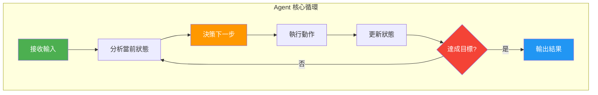
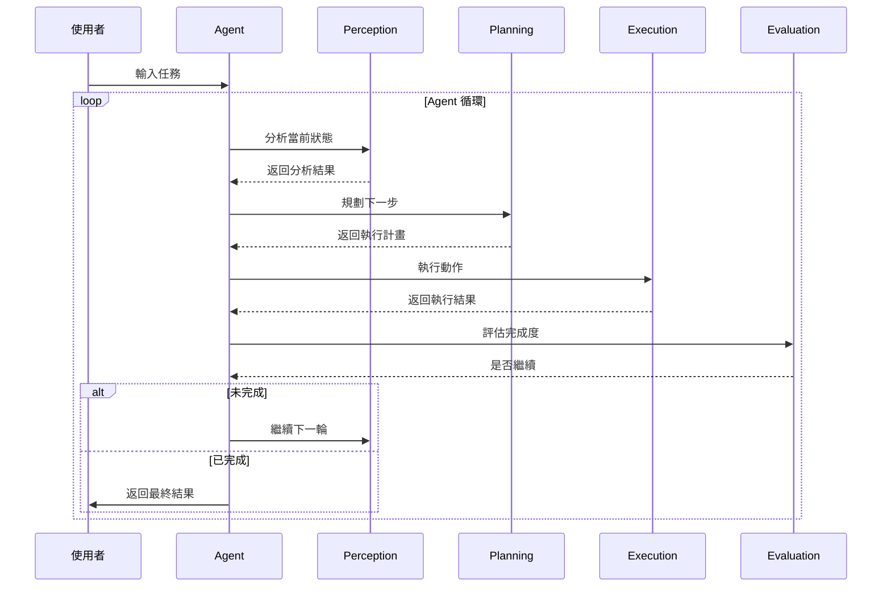

# Agent 工作原理

## 概述

理解 Agent 的工作原理是掌握 LangGraph 的關鍵。本章將深入探討 LangGraph Agent 的執行流程、決策機制和狀態管理,幫助您設計出高效可靠的 Agent 系統。



!!! quote "Agent 的本質"
    Agent 是一個能夠**感知環境**、**自主決策**並**採取行動**的智能系統。在 LangGraph 中,這透過 State、Node 和 Edge 的組合來實現。

## Agent 的執行流程

### 1. 完整執行週期

```python
from langgraph.graph import StateGraph, END
from typing import TypedDict, Annotated
from operator import add

# 定義 Agent 狀態
class AgentState(TypedDict):
    """Agent 的完整狀態"""
    # 輸入輸出
    input: str
    output: str

    # 執行追蹤
    current_step: str
    step_history: Annotated[list[str], add]

    # 決策資訊
    thoughts: Annotated[list[str], add]
    actions: Annotated[list[dict], add]

    # 執行控制
    iteration: int
    max_iterations: int
    is_finished: bool

# Agent 執行流程示意
def perception_node(state: AgentState) -> AgentState:
    """感知階段:分析當前狀態和需求"""
    analysis = f"分析輸入: {state['input']}"

    return {
        "current_step": "perception",
        "step_history": ["perception"],
        "thoughts": [analysis]
    }

def planning_node(state: AgentState) -> AgentState:
    """規劃階段:決定執行策略"""
    from langchain_openai import ChatOpenAI

    llm = ChatOpenAI(model="gpt-4")

    prompt = f"""
    任務: {state['input']}
    已執行步驟: {state['step_history']}

    請規劃下一步應該執行什麼動作。
    """

    plan = llm.invoke(prompt).content

    return {
        "current_step": "planning",
        "step_history": ["planning"],
        "thoughts": [f"計畫: {plan}"]
    }

def execution_node(state: AgentState) -> AgentState:
    """執行階段:實際執行動作"""
    # 模擬執行動作
    action_result = f"執行結果: 完成第 {state['iteration']} 次迭代"

    return {
        "current_step": "execution",
        "step_history": ["execution"],
        "actions": [{"iteration": state["iteration"], "result": action_result}],
        "iteration": state["iteration"] + 1
    }

def evaluation_node(state: AgentState) -> AgentState:
    """評估階段:檢查是否完成目標"""
    # 簡化的完成判斷
    is_done = state["iteration"] >= state["max_iterations"]

    return {
        "current_step": "evaluation",
        "step_history": ["evaluation"],
        "is_finished": is_done,
        "thoughts": [f"評估: {'已完成' if is_done else '繼續執行'}"]
    }

# 建立 Agent 工作流程
def create_agent():
    workflow = StateGraph(AgentState)

    # 添加各階段節點
    workflow.add_node("perceive", perception_node)
    workflow.add_node("plan", planning_node)
    workflow.add_node("execute", execution_node)
    workflow.add_node("evaluate", evaluation_node)

    # 設定流程
    workflow.set_entry_point("perceive")
    workflow.add_edge("perceive", "plan")
    workflow.add_edge("plan", "execute")
    workflow.add_edge("execute", "evaluate")

    # 條件循環
    def should_continue(state: AgentState) -> str:
        if state["is_finished"]:
            return "end"
        return "continue"

    workflow.add_conditional_edges(
        "evaluate",
        should_continue,
        {
            "continue": "perceive",  # 回到感知階段
            "end": END
        }
    )

    return workflow.compile()

# 執行 Agent
agent = create_agent()

result = agent.invoke({
    "input": "分析國泰人壽 2024 Q1 業績報告",
    "iteration": 0,
    "max_iterations": 3,
    "is_finished": False,
    "step_history": [],
    "thoughts": [],
    "actions": []
})

print("執行歷程:", result["step_history"])
print("思考過程:", result["thoughts"])
print("執行動作:", result["actions"])
```

### 2. 執行流程視覺化



## 決策機制

### 1. ReAct 模式 (Reasoning + Acting)

LangGraph 天然支援 ReAct 模式,交替進行推理和行動:

```python
from langchain_openai import ChatOpenAI
from langchain.tools import Tool

class ReActState(TypedDict):
    question: str
    thoughts: Annotated[list[str], add]
    actions: Annotated[list[dict], add]
    observations: Annotated[list[str], add]
    answer: str
    iteration: int

# 工具定義
def search_tool(query: str) -> str:
    """搜尋工具"""
    # 模擬搜尋
    return f"搜尋結果: {query} 的相關資訊..."

def calculator_tool(expression: str) -> str:
    """計算工具"""
    try:
        result = eval(expression)
        return f"計算結果: {result}"
    except:
        return "計算錯誤"

tools = {
    "search": search_tool,
    "calculator": calculator_tool
}

def thought_node(state: ReActState) -> ReActState:
    """推理階段:思考下一步要做什麼"""
    llm = ChatOpenAI(model="gpt-4")

    context = f"""
    問題: {state['question']}
    已執行的思考: {state['thoughts']}
    已執行的動作: {state['actions']}
    觀察到的結果: {state['observations']}

    思考下一步應該:
    1. 使用什麼工具?
    2. 或者已經可以回答問題?

    請回答格式:
    Thought: [你的思考]
    Action: [工具名稱] 或 "Answer"
    Action Input: [工具輸入] 或 [最終答案]
    """

    response = llm.invoke(context).content

    # 解析回應
    thought = extract_thought(response)
    action = extract_action(response)
    action_input = extract_action_input(response)

    return {
        "thoughts": [thought],
        "actions": [{
            "action": action,
            "input": action_input,
            "iteration": state["iteration"]
        }],
        "iteration": state["iteration"] + 1
    }

def action_node(state: ReActState) -> ReActState:
    """行動階段:執行工具或生成答案"""
    last_action = state["actions"][-1]
    action_name = last_action["action"]
    action_input = last_action["input"]

    if action_name == "Answer":
        # 生成最終答案
        return {
            "answer": action_input,
            "observations": ["任務完成"]
        }

    # 執行工具
    if action_name in tools:
        observation = tools[action_name](action_input)
        return {
            "observations": [observation]
        }

    return {
        "observations": ["未知動作"]
    }

def extract_thought(response: str) -> str:
    """提取思考內容"""
    if "Thought:" in response:
        return response.split("Thought:")[1].split("\n")[0].strip()
    return response

def extract_action(response: str) -> str:
    """提取動作"""
    if "Action:" in response:
        return response.split("Action:")[1].split("\n")[0].strip()
    return "Answer"

def extract_action_input(response: str) -> str:
    """提取動作輸入"""
    if "Action Input:" in response:
        return response.split("Action Input:")[1].split("\n")[0].strip()
    return ""

# 建立 ReAct Agent
workflow = StateGraph(ReActState)

workflow.add_node("think", thought_node)
workflow.add_node("act", action_node)

workflow.set_entry_point("think")
workflow.add_edge("think", "act")

def should_continue(state: ReActState) -> str:
    if state.get("answer") or state["iteration"] >= 5:
        return "end"
    return "continue"

workflow.add_conditional_edges(
    "act",
    should_continue,
    {
        "continue": "think",
        "end": END
    }
)

react_agent = workflow.compile()

# 使用範例
result = react_agent.invoke({
    "question": "國泰人壽 2023 年總保費收入是多少?成長率如何?",
    "thoughts": [],
    "actions": [],
    "observations": [],
    "iteration": 0
})
```

### 2. Chain of Thought (思維鏈)

```python
class CoTState(TypedDict):
    problem: str
    reasoning_steps: Annotated[list[str], add]
    current_step: int
    total_steps: int
    answer: str

def decompose_problem(state: CoTState) -> CoTState:
    """分解問題為多個步驟"""
    llm = ChatOpenAI(model="gpt-4")

    prompt = f"""
    將以下複雜問題分解為 3-5 個簡單步驟:
    {state['problem']}

    以列表形式回答,每行一個步驟。
    """

    steps = llm.invoke(prompt).content.split("\n")
    steps = [s.strip() for s in steps if s.strip()]

    return {
        "reasoning_steps": steps,
        "total_steps": len(steps),
        "current_step": 0
    }

def solve_step(state: CoTState) -> CoTState:
    """解決當前步驟"""
    llm = ChatOpenAI(model="gpt-4")

    current = state["current_step"]
    step = state["reasoning_steps"][current]

    prompt = f"""
    問題: {state['problem']}
    當前步驟: {step}
    之前的推理: {state['reasoning_steps'][:current]}

    請解決這一步驟。
    """

    solution = llm.invoke(prompt).content

    return {
        "reasoning_steps": [f"步驟 {current + 1}: {solution}"],
        "current_step": current + 1
    }

def synthesize_answer(state: CoTState) -> CoTState:
    """綜合所有步驟得出最終答案"""
    llm = ChatOpenAI(model="gpt-4")

    prompt = f"""
    問題: {state['problem']}
    推理過程: {state['reasoning_steps']}

    根據以上推理,給出最終答案。
    """

    answer = llm.invoke(prompt).content

    return {"answer": answer}

# 建立 CoT Agent
cot_workflow = StateGraph(CoTState)

cot_workflow.add_node("decompose", decompose_problem)
cot_workflow.add_node("solve", solve_step)
cot_workflow.add_node("synthesize", synthesize_answer)

cot_workflow.set_entry_point("decompose")
cot_workflow.add_edge("decompose", "solve")

def check_completion(state: CoTState) -> str:
    if state["current_step"] >= state["total_steps"]:
        return "synthesize"
    return "solve"

cot_workflow.add_conditional_edges(
    "solve",
    check_completion,
    {
        "solve": "solve",
        "synthesize": "synthesize"
    }
)

cot_workflow.add_edge("synthesize", END)

cot_agent = cot_workflow.compile()
```

## 狀態管理深度解析

### 1. 狀態的生命週期

```python
from typing import TypedDict, Annotated, Optional
from operator import add
from datetime import datetime

class StateLifecycle(TypedDict):
    """完整的狀態生命週期管理"""

    # 1. 初始化狀態
    created_at: datetime
    session_id: str

    # 2. 輸入狀態
    user_input: str
    parsed_input: dict

    # 3. 處理狀態
    current_node: str
    visited_nodes: Annotated[list[str], add]
    execution_path: Annotated[list[dict], add]

    # 4. 中間狀態
    intermediate_results: dict
    cached_data: dict

    # 5. 錯誤狀態
    errors: Annotated[list[dict], add]
    retry_count: int
    last_error: Optional[str]

    # 6. 輸出狀態
    final_result: Optional[dict]
    completed: bool
    completed_at: Optional[datetime]

    # 7. 追蹤狀態
    metrics: dict  # 執行時間、token 使用等

def initialize_state(user_input: str) -> StateLifecycle:
    """初始化狀態"""
    return {
        "created_at": datetime.now(),
        "session_id": generate_session_id(),
        "user_input": user_input,
        "visited_nodes": [],
        "execution_path": [],
        "errors": [],
        "retry_count": 0,
        "completed": False,
        "metrics": {
            "start_time": datetime.now(),
            "total_tokens": 0
        }
    }

def track_node_execution(state: StateLifecycle, node_name: str):
    """追蹤節點執行"""
    return {
        "current_node": node_name,
        "visited_nodes": [node_name],
        "execution_path": [{
            "node": node_name,
            "timestamp": datetime.now(),
            "state_snapshot": str(state)[:100]  # 簡化的快照
        }]
    }
```

### 2. 狀態持久化

```python
import json
from pathlib import Path

class StatePersistence:
    """狀態持久化管理"""

    def __init__(self, storage_path: str = "./agent_states"):
        self.storage_path = Path(storage_path)
        self.storage_path.mkdir(exist_ok=True)

    def save_state(self, session_id: str, state: dict):
        """儲存狀態"""
        file_path = self.storage_path / f"{session_id}.json"

        # 處理不可序列化的物件
        serializable_state = self._make_serializable(state)

        with open(file_path, 'w', encoding='utf-8') as f:
            json.dump(serializable_state, f, ensure_ascii=False, indent=2)

    def load_state(self, session_id: str) -> dict:
        """載入狀態"""
        file_path = self.storage_path / f"{session_id}.json"

        if not file_path.exists():
            raise ValueError(f"Session {session_id} not found")

        with open(file_path, 'r', encoding='utf-8') as f:
            return json.load(f)

    def _make_serializable(self, obj):
        """轉換為可序列化物件"""
        if isinstance(obj, datetime):
            return obj.isoformat()
        elif isinstance(obj, dict):
            return {k: self._make_serializable(v) for k, v in obj.items()}
        elif isinstance(obj, list):
            return [self._make_serializable(i) for i in obj]
        return obj

# 在節點中使用持久化
persistence = StatePersistence()

def checkpoint_node(state: StateLifecycle) -> StateLifecycle:
    """檢查點節點:儲存狀態"""
    persistence.save_state(state["session_id"], state)
    return {"visited_nodes": ["checkpoint"]}

def recovery_node(session_id: str) -> StateLifecycle:
    """恢復節點:從檢查點恢復"""
    return persistence.load_state(session_id)
```

### 3. 狀態快照和版本控制

```python
from collections import deque
from copy import deepcopy

class StateHistory:
    """狀態歷史管理"""

    def __init__(self, max_history: int = 10):
        self.history = deque(maxlen=max_history)
        self.current_version = 0

    def snapshot(self, state: dict) -> int:
        """建立狀態快照"""
        snapshot = {
            "version": self.current_version,
            "timestamp": datetime.now(),
            "state": deepcopy(state)
        }
        self.history.append(snapshot)
        self.current_version += 1
        return snapshot["version"]

    def rollback(self, version: int) -> dict:
        """回滾到指定版本"""
        for snapshot in reversed(self.history):
            if snapshot["version"] == version:
                return deepcopy(snapshot["state"])
        raise ValueError(f"Version {version} not found")

    def get_diff(self, version1: int, version2: int) -> dict:
        """比較兩個版本的差異"""
        state1 = self.rollback(version1)
        state2 = self.rollback(version2)

        diff = {}
        for key in set(state1.keys()) | set(state2.keys()):
            if state1.get(key) != state2.get(key):
                diff[key] = {
                    "old": state1.get(key),
                    "new": state2.get(key)
                }

        return diff

# 使用範例
history = StateHistory()

def versioned_node(state: AgentState) -> AgentState:
    """帶版本控制的節點"""
    # 執行前建立快照
    version = history.snapshot(state)

    try:
        # 執行處理
        result = process_data(state)
        return result
    except Exception as e:
        # 發生錯誤時回滾
        print(f"錯誤發生,回滾到版本 {version}")
        return history.rollback(version)
```

## 執行控制機制

### 1. 迭代控制

```python
class IterationControl(TypedDict):
    iteration: int
    max_iterations: int
    early_stop_threshold: float
    quality_scores: Annotated[list[float], add]

def controlled_iteration_node(state: IterationControl) -> IterationControl:
    """帶迭代控制的節點"""

    # 執行處理並計算品質分數
    result, quality = process_with_quality_check(state)

    return {
        "iteration": state["iteration"] + 1,
        "quality_scores": [quality],
        "result": result
    }

def should_continue_iteration(state: IterationControl) -> str:
    """決定是否繼續迭代"""

    # 檢查 1: 達到最大迭代次數
    if state["iteration"] >= state["max_iterations"]:
        return "max_iterations_reached"

    # 檢查 2: 品質達標可提前停止
    if state["quality_scores"]:
        latest_quality = state["quality_scores"][-1]
        if latest_quality >= state["early_stop_threshold"]:
            return "quality_threshold_met"

    # 檢查 3: 品質連續下降則停止
    if len(state["quality_scores"]) >= 3:
        recent = state["quality_scores"][-3:]
        if all(recent[i] > recent[i+1] for i in range(len(recent)-1)):
            return "quality_degrading"

    return "continue"
```

### 2. 超時控制

```python
import time
from functools import wraps

class TimeoutControl(TypedDict):
    start_time: float
    timeout_seconds: int
    elapsed_time: float

def with_timeout(timeout_seconds: int):
    """超時裝飾器"""
    def decorator(func):
        @wraps(func)
        def wrapper(state):
            start = time.time()

            # 檢查是否已超時
            if "start_time" in state:
                elapsed = time.time() - state["start_time"]
                if elapsed > timeout_seconds:
                    raise TimeoutError(f"執行超時: {elapsed:.2f}秒")

            # 執行函數
            result = func(state)

            # 更新執行時間
            if isinstance(result, dict):
                result["elapsed_time"] = time.time() - state.get("start_time", start)

            return result
        return wrapper
    return decorator

@with_timeout(timeout_seconds=30)
def time_limited_node(state: TimeoutControl) -> TimeoutControl:
    """有時間限制的節點"""
    # 執行耗時操作
    result = expensive_operation(state)
    return {"result": result}
```

### 3. 資源控制

```python
class ResourceControl(TypedDict):
    token_budget: int
    tokens_used: int
    cost_budget: float
    cost_used: float

def track_resource_usage(state: ResourceControl, tokens: int, cost: float):
    """追蹤資源使用"""
    new_tokens = state["tokens_used"] + tokens
    new_cost = state["cost_used"] + cost

    # 檢查預算
    if new_tokens > state["token_budget"]:
        raise ResourceError(f"Token 預算超支: {new_tokens}/{state['token_budget']}")

    if new_cost > state["cost_budget"]:
        raise ResourceError(f"成本預算超支: ${new_cost:.2f}/${state['cost_budget']:.2f}")

    return {
        "tokens_used": new_tokens,
        "cost_used": new_cost
    }

def resource_aware_node(state: ResourceControl) -> ResourceControl:
    """資源感知節點"""
    llm = ChatOpenAI(model="gpt-4", callbacks=[TokenTracker()])

    response = llm.invoke(state["prompt"])

    # 計算使用的資源
    tokens_used = count_tokens(response)
    cost = calculate_cost(tokens_used, model="gpt-4")

    # 更新資源追蹤
    resource_update = track_resource_usage(state, tokens_used, cost)

    return {
        **resource_update,
        "response": response.content
    }
```

## 國泰人壽實戰:理賠申請 Agent

```python
from enum import Enum

class ClaimStatus(Enum):
    SUBMITTED = "已提交"
    DOCUMENT_REVIEW = "文件審核中"
    MEDICAL_REVIEW = "醫療審核中"
    APPROVED = "已核准"
    REJECTED = "已拒絕"
    PENDING_INFO = "待補充資料"

class ClaimAgentState(TypedDict):
    # 申請資訊
    claim_id: str
    policy_number: str
    claim_amount: float
    claim_type: str

    # 文件資訊
    documents: list[dict]
    document_status: dict

    # 審核狀態
    status: str
    review_stage: str
    approval_level: int

    # 審核結果
    document_issues: Annotated[list[str], add]
    medical_findings: dict
    decision: Optional[str]
    approved_amount: Optional[float]

    # 流程追蹤
    timeline: Annotated[list[dict], add]
    assigned_reviewer: str

def submit_claim_node(state: ClaimAgentState) -> ClaimAgentState:
    """提交理賠申請"""
    return {
        "claim_id": generate_claim_id(),
        "status": ClaimStatus.SUBMITTED.value,
        "timeline": [{
            "event": "理賠申請已提交",
            "timestamp": datetime.now().isoformat()
        }]
    }

def verify_documents_node(state: ClaimAgentState) -> ClaimAgentState:
    """驗證文件完整性"""
    required_docs = get_required_documents(state["claim_type"])
    submitted_docs = [doc["type"] for doc in state["documents"]]

    issues = []
    for req_doc in required_docs:
        if req_doc not in submitted_docs:
            issues.append(f"缺少文件: {req_doc}")

    # 使用 AI 檢查文件品質
    for doc in state["documents"]:
        quality_check = check_document_quality(doc)
        if not quality_check["passed"]:
            issues.extend(quality_check["issues"])

    status = ClaimStatus.DOCUMENT_REVIEW.value

    return {
        "document_issues": issues,
        "status": status,
        "timeline": [{
            "event": "文件審核完成",
            "issues_found": len(issues),
            "timestamp": datetime.now().isoformat()
        }]
    }

def medical_review_node(state: ClaimAgentState) -> ClaimAgentState:
    """醫療審核"""
    llm = ChatOpenAI(model="gpt-4")

    prompt = f"""
    審核以下理賠申請:
    - 保單類型: {state['claim_type']}
    - 理賠金額: {state['claim_amount']}
    - 提交文件: {state['documents']}

    請分析:
    1. 是否符合保單條款
    2. 金額是否合理
    3. 是否有可疑之處

    以 JSON 格式回答。
    """

    import json
    review = json.loads(llm.invoke(prompt).content)

    return {
        "medical_findings": review,
        "status": ClaimStatus.MEDICAL_REVIEW.value,
        "timeline": [{
            "event": "醫療審核完成",
            "timestamp": datetime.now().isoformat()
        }]
    }

def make_decision_node(state: ClaimAgentState) -> ClaimAgentState:
    """做出理賠決定"""

    # 自動決策邏輯
    if state["document_issues"]:
        decision = "PENDING_INFO"
        approved_amount = None
    elif state["medical_findings"].get("suspicious"):
        decision = "REJECTED"
        approved_amount = None
    elif state["claim_amount"] <= state["medical_findings"].get("reasonable_amount", 0):
        decision = "APPROVED"
        approved_amount = state["claim_amount"]
    else:
        decision = "APPROVED"
        approved_amount = state["medical_findings"]["reasonable_amount"]

    return {
        "decision": decision,
        "approved_amount": approved_amount,
        "status": ClaimStatus[decision].value,
        "timeline": [{
            "event": f"理賠決定: {decision}",
            "amount": approved_amount,
            "timestamp": datetime.now().isoformat()
        }]
    }

def notify_customer_node(state: ClaimAgentState) -> ClaimAgentState:
    """通知客戶"""
    send_notification(
        customer_id=get_customer_from_policy(state["policy_number"]),
        message=generate_notification_message(state)
    )

    return {
        "timeline": [{
            "event": "已通知客戶",
            "timestamp": datetime.now().isoformat()
        }]
    }

# 建立理賠 Agent
def create_claim_agent():
    workflow = StateGraph(ClaimAgentState)

    # 添加節點
    workflow.add_node("submit", submit_claim_node)
    workflow.add_node("verify_docs", verify_documents_node)
    workflow.add_node("medical_review", medical_review_node)
    workflow.add_node("decide", make_decision_node)
    workflow.add_node("notify", notify_customer_node)

    # 設定流程
    workflow.set_entry_point("submit")
    workflow.add_edge("submit", "verify_docs")

    # 文件審核後的路由
    def after_document_review(state: ClaimAgentState) -> str:
        if state["document_issues"]:
            return "request_more_docs"
        return "proceed_to_medical"

    workflow.add_conditional_edges(
        "verify_docs",
        after_document_review,
        {
            "request_more_docs": "notify",
            "proceed_to_medical": "medical_review"
        }
    )

    workflow.add_edge("medical_review", "decide")
    workflow.add_edge("decide", "notify")
    workflow.add_edge("notify", END)

    return workflow.compile()

# 使用範例
claim_agent = create_claim_agent()

result = claim_agent.invoke({
    "policy_number": "P123456",
    "claim_amount": 50000,
    "claim_type": "醫療險",
    "documents": [
        {"type": "diagnosis", "content": "..."},
        {"type": "receipts", "content": "..."}
    ],
    "document_issues": [],
    "timeline": []
})

print(f"理賠決定: {result['decision']}")
print(f"核准金額: {result['approved_amount']}")
print(f"處理時間軸: {result['timeline']}")
```

## 重點整理

### Agent 執行流程

1. **感知階段**: 分析輸入和當前狀態
2. **規劃階段**: 決定執行策略
3. **執行階段**: 實際執行動作
4. **評估階段**: 檢查完成度,決定是否繼續

### 決策機制

1. **ReAct 模式**: 交替進行推理和行動
2. **Chain of Thought**: 分步驟推理
3. **條件路由**: 根據狀態動態決策

### 狀態管理

1. **生命週期管理**: 追蹤狀態從初始化到完成
2. **持久化**: 儲存和恢復狀態
3. **版本控制**: 快照和回滾機制

### 執行控制

1. **迭代控制**: 限制循環次數,提前停止
2. **超時控制**: 防止無限執行
3. **資源控制**: 管理 token 和成本預算

## 練習建議

### 練習 1: 實作 ReAct Agent

建立一個 ReAct Agent 來回答複雜問題,需要:
- 至少 3 個工具
- 完整的推理過程記錄
- 迭代次數限制

### 練習 2: 狀態持久化

為任一 Agent 添加:
- 狀態儲存功能
- 從檢查點恢復
- 查看執行歷史

### 練習 3: 資源控制

實作資源感知 Agent:
- Token 使用追蹤
- 成本計算
- 預算超支警告

## 下一步

現在您已經深入理解 Agent 的工作原理!下一章我們將學習如何設計優雅的 State Graph,運用各種設計模式來建立強大的工作流程。

<div style="text-align: center; margin: 2em 0;">
    <a href="../05-state-graph/" style="
        display: inline-block;
        padding: 12px 24px;
        background-color: #FF9800;
        color: white;
        text-decoration: none;
        border-radius: 4px;
        font-weight: bold;
    ">
        下一章: State Graph 設計模式 →
    </a>
</div>
