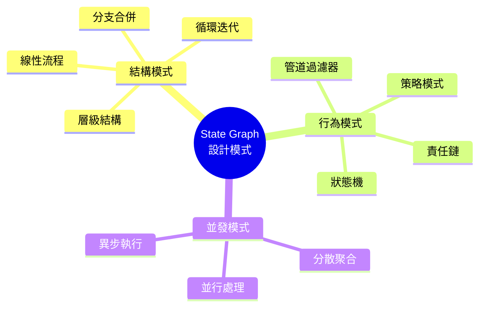

# State Graph 設計模式

## 概述

State Graph 是 LangGraph 的核心,良好的圖形設計能讓 Agent 更清晰、可維護和高效。本章將介紹常見的設計模式和最佳實踐,幫助您設計出優雅的工作流程。



## 基礎設計模式

### 1. 線性流程模式 (Sequential Pipeline)

最簡單的模式,按順序執行節點:

```python
from langgraph.graph import StateGraph, END
from typing import TypedDict

class PipelineState(TypedDict):
    raw_data: str
    cleaned_data: str
    processed_data: str
    result: str

def clean_data(state: PipelineState) -> PipelineState:
    """清理數據"""
    cleaned = state["raw_data"].strip().lower()
    return {"cleaned_data": cleaned}

def process_data(state: PipelineState) -> PipelineState:
    """處理數據"""
    processed = f"處理後: {state['cleaned_data']}"
    return {"processed_data": processed}

def generate_result(state: PipelineState) -> PipelineState:
    """生成結果"""
    result = f"最終結果: {state['processed_data']}"
    return {"result": result}

# 建立線性流程
workflow = StateGraph(PipelineState)
workflow.add_node("clean", clean_data)
workflow.add_node("process", process_data)
workflow.add_node("generate", generate_result)

workflow.set_entry_point("clean")
workflow.add_edge("clean", "process")
workflow.add_edge("process", "generate")
workflow.add_edge("generate", END)

pipeline = workflow.compile()
```

**適用場景**: 資料處理管道、ETL 流程、簡單的轉換鏈

### 2. 條件分支模式 (Conditional Branching)

根據狀態選擇不同的執行路徑:

```python
class BranchingState(TypedDict):
    user_type: str  # "new" or "existing"
    message: str
    response: str

def classify_user(state: BranchingState) -> BranchingState:
    """分類使用者"""
    # 實際會從資料庫查詢
    user_type = "new" if not user_exists(state) else "existing"
    return {"user_type": user_type}

def onboard_new_user(state: BranchingState) -> BranchingState:
    """新用戶引導"""
    response = "歡迎新用戶!這是引導流程..."
    return {"response": response}

def serve_existing_user(state: BranchingState) -> BranchingState:
    """服務現有用戶"""
    response = "歡迎回來!為您提供服務..."
    return {"response": response}

# 路由函數
def route_by_user_type(state: BranchingState) -> str:
    return state["user_type"]

workflow = StateGraph(BranchingState)
workflow.add_node("classify", classify_user)
workflow.add_node("onboard", onboard_new_user)
workflow.add_node("serve", serve_existing_user)

workflow.set_entry_point("classify")
workflow.add_conditional_edges(
    "classify",
    route_by_user_type,
    {
        "new": "onboard",
        "existing": "serve"
    }
)

workflow.add_edge("onboard", END)
workflow.add_edge("serve", END)
```

**適用場景**: 使用者分類、內容路由、個性化服務

### 3. 循環迭代模式 (Iterative Loop)

重複執行直到滿足條件:

```python
class IterativeState(TypedDict):
    prompt: str
    response: str
    quality_score: float
    iteration: int
    max_iterations: int

def generate_response(state: IterativeState) -> IterativeState:
    """生成回應"""
    from langchain_openai import ChatOpenAI

    llm = ChatOpenAI(model="gpt-4")
    response = llm.invoke(state["prompt"]).content

    return {
        "response": response,
        "iteration": state["iteration"] + 1
    }

def evaluate_quality(state: IterativeState) -> IterativeState:
    """評估品質"""
    # 簡化的品質評估
    score = len(state["response"]) / 100  # 示例
    return {"quality_score": min(score, 1.0)}

def refine_prompt(state: IterativeState) -> IterativeState:
    """優化提示詞"""
    refined = f"{state['prompt']}\n請提供更詳細的回答。"
    return {"prompt": refined}

def should_continue(state: IterativeState) -> str:
    if state["quality_score"] >= 0.8:
        return "done"
    if state["iteration"] >= state["max_iterations"]:
        return "done"
    return "refine"

workflow = StateGraph(IterativeState)
workflow.add_node("generate", generate_response)
workflow.add_node("evaluate", evaluate_quality)
workflow.add_node("refine", refine_prompt)

workflow.set_entry_point("generate")
workflow.add_edge("generate", "evaluate")
workflow.add_conditional_edges(
    "evaluate",
    should_continue,
    {
        "done": END,
        "refine": "refine"
    }
)
workflow.add_edge("refine", "generate")
```

**適用場景**: 結果優化、自我改進、品質保證

### 4. 分散聚合模式 (Scatter-Gather)

並行處理多個任務後合併結果:

```python
from concurrent.futures import ThreadPoolExecutor
from typing import Annotated
from operator import add

class ScatterGatherState(TypedDict):
    query: str
    search_results: Annotated[list, add]
    database_results: Annotated[list, add]
    api_results: Annotated[list, add]
    merged_results: list

def scatter_node(state: ScatterGatherState) -> ScatterGatherState:
    """分散任務"""
    # 這裡只是標記,實際並行在各個節點內部
    return {"query": state["query"]}

def search_web(state: ScatterGatherState) -> ScatterGatherState:
    """網頁搜尋"""
    results = perform_web_search(state["query"])
    return {"search_results": results}

def query_database(state: ScatterGatherState) -> ScatterGatherState:
    """資料庫查詢"""
    results = query_db(state["query"])
    return {"database_results": results}

def call_api(state: ScatterGatherState) -> ScatterGatherState:
    """API 調用"""
    results = call_external_api(state["query"])
    return {"api_results": results}

def parallel_search_node(state: ScatterGatherState) -> ScatterGatherState:
    """並行執行所有搜尋"""
    with ThreadPoolExecutor(max_workers=3) as executor:
        # 並行執行
        web_future = executor.submit(perform_web_search, state["query"])
        db_future = executor.submit(query_db, state["query"])
        api_future = executor.submit(call_external_api, state["query"])

        # 收集結果
        return {
            "search_results": [web_future.result()],
            "database_results": [db_future.result()],
            "api_results": [api_future.result()]
        }

def gather_node(state: ScatterGatherState) -> ScatterGatherState:
    """聚合結果"""
    all_results = (
        state["search_results"] +
        state["database_results"] +
        state["api_results"]
    )

    # 去重和排序
    merged = deduplicate_and_rank(all_results)

    return {"merged_results": merged}

workflow = StateGraph(ScatterGatherState)
workflow.add_node("parallel_search", parallel_search_node)
workflow.add_node("gather", gather_node)

workflow.set_entry_point("parallel_search")
workflow.add_edge("parallel_search", "gather")
workflow.add_edge("gather", END)
```

**適用場景**: 多來源資料整合、並行搜尋、分散式處理

## 進階設計模式

### 5. 狀態機模式 (State Machine)

管理複雜的狀態轉換:

```python
from enum import Enum

class OrderStatus(Enum):
    CREATED = "created"
    PAYMENT_PENDING = "payment_pending"
    PAYMENT_CONFIRMED = "payment_confirmed"
    PROCESSING = "processing"
    SHIPPED = "shipped"
    DELIVERED = "delivered"
    CANCELLED = "cancelled"

class OrderState(TypedDict):
    order_id: str
    status: str
    payment_method: str
    shipping_address: str
    timeline: Annotated[list[dict], add]

def create_order(state: OrderState) -> OrderState:
    return {
        "order_id": generate_order_id(),
        "status": OrderStatus.CREATED.value,
        "timeline": [{"event": "訂單建立", "timestamp": now()}]
    }

def process_payment(state: OrderState) -> OrderState:
    # 處理支付
    payment_success = process_payment_gateway(state)

    new_status = (
        OrderStatus.PAYMENT_CONFIRMED.value if payment_success
        else OrderStatus.PAYMENT_PENDING.value
    )

    return {
        "status": new_status,
        "timeline": [{"event": "支付處理", "timestamp": now()}]
    }

def prepare_shipment(state: OrderState) -> OrderState:
    return {
        "status": OrderStatus.PROCESSING.value,
        "timeline": [{"event": "準備出貨", "timestamp": now()}]
    }

def ship_order(state: OrderState) -> OrderState:
    return {
        "status": OrderStatus.SHIPPED.value,
        "timeline": [{"event": "已出貨", "timestamp": now()}]
    }

# 狀態轉換路由
def route_order_status(state: OrderState) -> str:
    status = OrderStatus(state["status"])

    transitions = {
        OrderStatus.CREATED: "payment",
        OrderStatus.PAYMENT_CONFIRMED: "prepare",
        OrderStatus.PROCESSING: "ship",
        OrderStatus.SHIPPED: "end"
    }

    return transitions.get(status, "end")

workflow = StateGraph(OrderState)
workflow.add_node("create", create_order)
workflow.add_node("payment", process_payment)
workflow.add_node("prepare", prepare_shipment)
workflow.add_node("ship", ship_order)

workflow.set_entry_point("create")
workflow.add_edge("create", "payment")

workflow.add_conditional_edges(
    "payment",
    lambda s: "prepare" if s["status"] == OrderStatus.PAYMENT_CONFIRMED.value else END
)

workflow.add_edge("prepare", "ship")
workflow.add_edge("ship", END)
```

**適用場景**: 訂單處理、工單流程、審批系統

### 6. 責任鏈模式 (Chain of Responsibility)

依序嘗試多個處理器:

```python
class HandlerState(TypedDict):
    request: str
    handled: bool
    handler_used: str
    response: str

def basic_handler(state: HandlerState) -> HandlerState:
    """基礎處理器"""
    if is_basic_query(state["request"]):
        return {
            "handled": True,
            "handler_used": "basic",
            "response": "基礎回答"
        }
    return {"handled": False}

def advanced_handler(state: HandlerState) -> HandlerState:
    """進階處理器"""
    if is_advanced_query(state["request"]):
        return {
            "handled": True,
            "handler_used": "advanced",
            "response": "進階回答"
        }
    return {"handled": False}

def expert_handler(state: HandlerState) -> HandlerState:
    """專家處理器"""
    return {
        "handled": True,
        "handler_used": "expert",
        "response": "專家級回答"
    }

def route_to_next_handler(state: HandlerState) -> str:
    if state["handled"]:
        return "done"

    # 根據當前處理器決定下一個
    current = state.get("handler_used", "")
    if current == "basic":
        return "advanced"
    elif current == "advanced":
        return "expert"
    return "basic"

workflow = StateGraph(HandlerState)
workflow.add_node("basic", basic_handler)
workflow.add_node("advanced", advanced_handler)
workflow.add_node("expert", expert_handler)

workflow.set_entry_point("basic")

workflow.add_conditional_edges(
    "basic",
    route_to_next_handler,
    {"done": END, "advanced": "advanced"}
)

workflow.add_conditional_edges(
    "advanced",
    route_to_next_handler,
    {"done": END, "expert": "expert"}
)

workflow.add_edge("expert", END)
```

**適用場景**: 逐級升級處理、權限驗證鏈、異常處理

### 7. 策略模式 (Strategy Pattern)

動態選擇處理策略:

```python
class StrategyState(TypedDict):
    problem_type: str
    complexity: str
    strategy: str
    solution: str

def analyze_problem(state: StrategyState) -> StrategyState:
    """分析問題並選擇策略"""
    # 根據問題特性選擇策略
    if state["complexity"] == "low":
        strategy = "simple"
    elif state["complexity"] == "medium":
        strategy = "standard"
    else:
        strategy = "advanced"

    return {"strategy": strategy}

def simple_strategy(state: StrategyState) -> StrategyState:
    """簡單策略"""
    return {"solution": "使用簡單方法解決"}

def standard_strategy(state: StrategyState) -> StrategyState:
    """標準策略"""
    return {"solution": "使用標準方法解決"}

def advanced_strategy(state: StrategyState) -> StrategyState:
    """進階策略"""
    return {"solution": "使用進階方法解決"}

def select_strategy(state: StrategyState) -> str:
    return state["strategy"]

workflow = StateGraph(StrategyState)
workflow.add_node("analyze", analyze_problem)
workflow.add_node("simple", simple_strategy)
workflow.add_node("standard", standard_strategy)
workflow.add_node("advanced", advanced_strategy)

workflow.set_entry_point("analyze")
workflow.add_conditional_edges(
    "analyze",
    select_strategy,
    {
        "simple": "simple",
        "standard": "standard",
        "advanced": "advanced"
    }
)

workflow.add_edge("simple", END)
workflow.add_edge("standard", END)
workflow.add_edge("advanced", END)
```

**適用場景**: 演算法選擇、處理策略切換、配置驅動流程

## 國泰人壽案例:客戶服務流程

整合多種模式的完整案例:

```python
class CustomerServiceState(TypedDict):
    # 客戶資訊
    customer_id: str
    customer_tier: str  # bronze, silver, gold, platinum

    # 請求資訊
    request_type: str
    request_detail: str
    urgency: str

    # 處理流程
    current_handler: str
    escalation_level: int
    timeline: Annotated[list[dict], add]

    # 結果
    resolution: str
    satisfaction_score: float

# 1. 初始分類 (策略模式)
def classify_request(state: CustomerServiceState) -> CustomerServiceState:
    """分類客戶請求"""
    from langchain_openai import ChatOpenAI

    llm = ChatOpenAI(model="gpt-4")

    prompt = f"""
    分類以下客戶請求:
    {state['request_detail']}

    類別: policy_query, claim, complaint, consultation
    急迫性: low, medium, high

    以 JSON 回答: {{"type": "...", "urgency": "..."}}
    """

    import json
    result = json.loads(llm.invoke(prompt).content)

    return {
        "request_type": result["type"],
        "urgency": result["urgency"],
        "timeline": [{"event": "請求已分類", "timestamp": now()}]
    }

# 2. 優先級路由 (條件分支)
def route_by_priority(state: CustomerServiceState) -> str:
    """根據客戶層級和急迫性路由"""
    tier = state["customer_tier"]
    urgency = state["urgency"]

    # VIP 客戶或高急迫性直接轉專員
    if tier in ["gold", "platinum"] or urgency == "high":
        return "specialist"

    # 一般客戶先嘗試自動處理
    return "auto_handler"

# 3. 自動處理 (責任鏈模式)
def auto_handler(state: CustomerServiceState) -> CustomerServiceState:
    """自動處理系統"""
    # 嘗試從知識庫找答案
    kb_result = search_knowledge_base(state["request_detail"])

    if kb_result["confidence"] > 0.8:
        return {
            "current_handler": "auto",
            "resolution": kb_result["answer"],
            "timeline": [{"event": "自動處理完成", "timestamp": now()}]
        }

    # 無法自動處理,升級
    return {
        "current_handler": "auto_failed",
        "escalation_level": 1,
        "timeline": [{"event": "升級至人工處理", "timestamp": now()}]
    }

# 4. 人工處理 (狀態機模式)
def specialist_handler(state: CustomerServiceState) -> CustomerServiceState:
    """專員處理"""
    # 分配給適合的專員
    specialist = assign_specialist(state["request_type"])

    return {
        "current_handler": f"specialist_{specialist}",
        "timeline": [{"event": f"已分配給專員 {specialist}", "timestamp": now()}]
    }

def senior_handler(state: CustomerServiceState) -> CustomerServiceState:
    """資深專員處理"""
    return {
        "current_handler": "senior",
        "escalation_level": 2,
        "timeline": [{"event": "資深專員接手", "timestamp": now()}]
    }

def manager_handler(state: CustomerServiceState) -> CustomerServiceState:
    """經理處理"""
    return {
        "current_handler": "manager",
        "escalation_level": 3,
        "resolution": "由經理親自處理並解決",
        "timeline": [{"event": "經理親自處理", "timestamp": now()}]
    }

# 5. 後續追蹤 (循環模式)
def follow_up(state: CustomerServiceState) -> CustomerServiceState:
    """後續追蹤"""
    # 發送滿意度調查
    score = collect_satisfaction(state["customer_id"])

    return {
        "satisfaction_score": score,
        "timeline": [{"event": "完成滿意度調查", "timestamp": now()}]
    }

def should_escalate(state: CustomerServiceState) -> str:
    """決定是否升級"""
    # 自動處理失敗
    if state["current_handler"] == "auto_failed":
        return "specialist"

    # 滿意度太低需要升級
    if state.get("satisfaction_score", 1.0) < 0.6:
        level = state["escalation_level"]
        if level == 1:
            return "senior"
        elif level == 2:
            return "manager"

    return "done"

# 建立完整工作流程
def create_customer_service_agent():
    workflow = StateGraph(CustomerServiceState)

    # 添加所有節點
    workflow.add_node("classify", classify_request)
    workflow.add_node("auto", auto_handler)
    workflow.add_node("specialist", specialist_handler)
    workflow.add_node("senior", senior_handler)
    workflow.add_node("manager", manager_handler)
    workflow.add_node("follow_up", follow_up)

    # 設定流程
    workflow.set_entry_point("classify")

    # 優先級路由
    workflow.add_conditional_edges(
        "classify",
        route_by_priority,
        {
            "auto_handler": "auto",
            "specialist": "specialist"
        }
    )

    # 自動處理後的路由
    workflow.add_conditional_edges(
        "auto",
        should_escalate,
        {
            "specialist": "specialist",
            "done": "follow_up"
        }
    )

    # 人工處理鏈
    workflow.add_edge("specialist", "follow_up")

    # 追蹤後可能升級
    workflow.add_conditional_edges(
        "follow_up",
        should_escalate,
        {
            "senior": "senior",
            "manager": "manager",
            "done": END
        }
    )

    workflow.add_edge("senior", END)
    workflow.add_edge("manager", END)

    return workflow.compile()

# 使用範例
cs_agent = create_customer_service_agent()

result = cs_agent.invoke({
    "customer_id": "C12345",
    "customer_tier": "silver",
    "request_detail": "我的保單理賠進度如何?",
    "escalation_level": 0,
    "timeline": []
})

print(f"處理人員: {result['current_handler']}")
print(f"解決方案: {result['resolution']}")
print(f"處理時間軸: {result['timeline']}")
```

## 設計最佳實踐

### 1. 單一職責原則

每個節點只做一件事:

```python
# ❌ 不好的設計
def big_node(state):
    # 做太多事情
    data = fetch_data()
    cleaned = clean_data(data)
    processed = process(cleaned)
    validated = validate(processed)
    saved = save(validated)
    return {"result": saved}

# ✅ 好的設計
def fetch_node(state):
    return {"raw_data": fetch_data()}

def clean_node(state):
    return {"cleaned_data": clean_data(state["raw_data"])}

def process_node(state):
    return {"processed_data": process(state["cleaned_data"])}
```

### 2. 清晰的狀態流動

使用有意義的狀態欄位名稱:

```python
# ❌ 不清晰
class State(TypedDict):
    data: str
    result: str
    temp: str

# ✅ 清晰
class State(TypedDict):
    user_input: str
    extracted_entities: dict
    generated_response: str
    validation_result: dict
```

### 3. 錯誤處理路徑

為錯誤情況設計明確的路徑:

```python
def safe_node(state):
    try:
        result = risky_operation(state)
        return {"result": result, "error": None}
    except Exception as e:
        return {"error": str(e), "retry_count": state.get("retry_count", 0) + 1}

def error_router(state):
    if state.get("error"):
        if state["retry_count"] < 3:
            return "retry"
        return "fallback"
    return "continue"
```

## 重點整理

### 基礎模式
- **線性流程**: 順序執行,適合簡單管道
- **條件分支**: 根據條件選擇路徑
- **循環迭代**: 重複優化直到滿足條件
- **分散聚合**: 並行處理後合併

### 進階模式
- **狀態機**: 管理複雜狀態轉換
- **責任鏈**: 逐級嘗試處理器
- **策略模式**: 動態選擇處理策略

### 設計原則
- 單一職責
- 清晰的狀態流動
- 明確的錯誤處理
- 可視化優先

## 練習建議

1. 選擇 3 種設計模式,建立實際應用
2. 設計一個訂單處理流程,整合多種模式
3. 為現有 Agent 繪製流程圖並優化

## 下一步

掌握了設計模式後,下一章我們將深入學習條件邊的進階使用,實現更複雜的路由邏輯。
