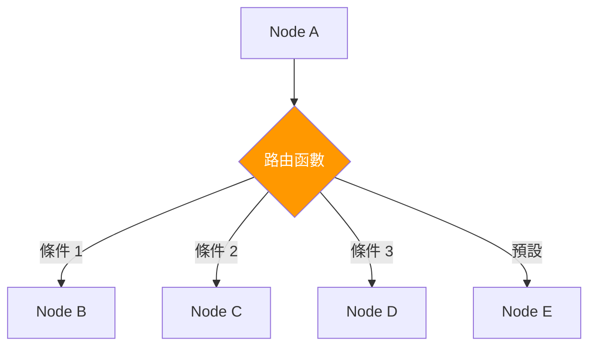

# 條件邊使用

## 概述

條件邊(Conditional Edges)是 LangGraph 最強大的功能之一,允許根據狀態動態決定工作流程的執行路徑。掌握條件邊的使用是建立智能 Agent 的關鍵。



!!! quote "條件邊的本質"
    條件邊讓 Agent 能夠**動態決策**,根據當前狀態選擇最適合的執行路徑,實現真正的智能化。

## 基礎用法

### 1. 簡單條件路由

```python
from langgraph.graph import StateGraph, END
from typing import TypedDict

class SimpleState(TypedDict):
    score: float
    result: str

def evaluate_node(state: SimpleState) -> SimpleState:
    # 計算分數
    score = calculate_score(state)
    return {"score": score}

def high_score_handler(state: SimpleState) -> SimpleState:
    return {"result": "優秀!"}

def low_score_handler(state: SimpleState) -> SimpleState:
    return {"result": "需要改進"}

# 路由函數
def route_by_score(state: SimpleState) -> str:
    """根據分數路由"""
    if state["score"] >= 0.8:
        return "high"
    else:
        return "low"

# 建立工作流程
workflow = StateGraph(SimpleState)
workflow.add_node("evaluate", evaluate_node)
workflow.add_node("high_handler", high_score_handler)
workflow.add_node("low_handler", low_score_handler)

workflow.set_entry_point("evaluate")

# 添加條件邊
workflow.add_conditional_edges(
    "evaluate",          # 從哪個節點出發
    route_by_score,      # 路由函數
    {
        "high": "high_handler",    # 映射:返回值 -> 目標節點
        "low": "low_handler"
    }
)

workflow.add_edge("high_handler", END)
workflow.add_edge("low_handler", END)

app = workflow.compile()
```

### 2. 多條件路由

```python
class MultiConditionState(TypedDict):
    user_type: str      # "individual" or "corporate"
    urgency: str        # "low", "medium", "high"
    complexity: str     # "simple" or "complex"
    route: str

def multi_condition_router(state: MultiConditionState) -> str:
    """複雜的多條件路由"""

    # 高優先級:企業客戶 + 高急迫性
    if state["user_type"] == "corporate" and state["urgency"] == "high":
        return "vip_fast_track"

    # 複雜問題需要專家
    if state["complexity"] == "complex":
        return "expert_handler"

    # 一般企業客戶
    if state["user_type"] == "corporate":
        return "corporate_handler"

    # 急迫的個人客戶
    if state["urgency"] == "high":
        return "priority_handler"

    # 預設路徑
    return "standard_handler"

workflow = StateGraph(MultiConditionState)

# ... 添加節點 ...

workflow.add_conditional_edges(
    "classify",
    multi_condition_router,
    {
        "vip_fast_track": "vip_node",
        "expert_handler": "expert_node",
        "corporate_handler": "corporate_node",
        "priority_handler": "priority_node",
        "standard_handler": "standard_node"
    }
)
```

### 3. 基於 AI 的動態路由

```python
from langchain_openai import ChatOpenAI

class AIRoutingState(TypedDict):
    user_message: str
    intent: str
    confidence: float

def ai_intent_classifier(state: AIRoutingState) -> AIRoutingState:
    """使用 AI 識別意圖"""
    llm = ChatOpenAI(model="gpt-4")

    prompt = f"""
    分析以下使用者訊息的意圖:
    "{state['user_message']}"

    可能的意圖:
    - policy_query: 保單查詢
    - claim_filing: 理賠申請
    - payment_issue: 繳費問題
    - general_inquiry: 一般諮詢

    回答格式: {{"intent": "...", "confidence": 0.95}}
    """

    import json
    result = json.loads(llm.invoke(prompt).content)

    return {
        "intent": result["intent"],
        "confidence": result["confidence"]
    }

def intelligent_router(state: AIRoutingState) -> str:
    """智能路由"""
    # 信心度太低,轉人工
    if state["confidence"] < 0.7:
        return "human_agent"

    # 根據意圖路由
    intent_mapping = {
        "policy_query": "policy_handler",
        "claim_filing": "claim_handler",
        "payment_issue": "payment_handler",
        "general_inquiry": "faq_handler"
    }

    return intent_mapping.get(state["intent"], "human_agent")

workflow = StateGraph(AIRoutingState)
workflow.add_node("classify", ai_intent_classifier)
# ... 添加處理節點 ...

workflow.add_conditional_edges(
    "classify",
    intelligent_router,
    {
        "policy_handler": "policy_node",
        "claim_handler": "claim_node",
        "payment_handler": "payment_node",
        "faq_handler": "faq_node",
        "human_agent": "human_node"
    }
)
```

## 進階技巧

### 1. 循環控制

```python
from typing import Annotated
from operator import add

class LoopState(TypedDict):
    data: str
    quality: float
    iteration: int
    max_iterations: int
    improvements: Annotated[list[str], add]

def process_data(state: LoopState) -> LoopState:
    """處理資料"""
    processed = improve_data(state["data"])
    quality = evaluate_quality(processed)

    return {
        "data": processed,
        "quality": quality,
        "iteration": state["iteration"] + 1,
        "improvements": [f"迭代 {state['iteration']}: 品質 {quality:.2f}"]
    }

def should_continue_loop(state: LoopState) -> str:
    """決定是否繼續循環"""

    # 條件 1: 達到品質標準
    if state["quality"] >= 0.9:
        return "quality_met"

    # 條件 2: 達到最大迭代次數
    if state["iteration"] >= state["max_iterations"]:
        return "max_iterations"

    # 條件 3: 品質不再提升(連續 3 次)
    if len(state["improvements"]) >= 3:
        recent_qualities = [
            float(imp.split(": 品質 ")[1])
            for imp in state["improvements"][-3:]
        ]
        if all(recent_qualities[i] >= recent_qualities[i+1]
               for i in range(len(recent_qualities)-1)):
            return "no_improvement"

    # 繼續循環
    return "continue"

workflow = StateGraph(LoopState)
workflow.add_node("process", process_data)

workflow.set_entry_point("process")

workflow.add_conditional_edges(
    "process",
    should_continue_loop,
    {
        "continue": "process",      # 回到自己,形成循環
        "quality_met": END,
        "max_iterations": END,
        "no_improvement": END
    }
)
```

### 2. 動態子圖選擇

```python
class SubgraphState(TypedDict):
    problem_domain: str  # "finance", "medical", "legal"
    complexity_level: str
    result: dict

# 定義不同領域的子圖
def create_finance_subgraph():
    """金融領域處理流程"""
    sub_workflow = StateGraph(SubgraphState)
    # ... 添加金融相關節點 ...
    return sub_workflow.compile()

def create_medical_subgraph():
    """醫療領域處理流程"""
    sub_workflow = StateGraph(SubgraphState)
    # ... 添加醫療相關節點 ...
    return sub_workflow.compile()

def create_legal_subgraph():
    """法律領域處理流程"""
    sub_workflow = StateGraph(SubgraphState)
    # ... 添加法律相關節點 ...
    return sub_workflow.compile()

# 主流程中動態選擇子圖
finance_graph = create_finance_subgraph()
medical_graph = create_medical_subgraph()
legal_graph = create_legal_subgraph()

def execute_domain_specific(state: SubgraphState) -> SubgraphState:
    """執行特定領域的處理"""
    domain = state["problem_domain"]

    if domain == "finance":
        result = finance_graph.invoke(state)
    elif domain == "medical":
        result = medical_graph.invoke(state)
    elif domain == "legal":
        result = legal_graph.invoke(state)
    else:
        result = {"error": "Unknown domain"}

    return {"result": result}
```

### 3. 基於外部 API 的路由

```python
import requests

class APIRoutingState(TypedDict):
    user_id: str
    subscription_tier: str
    api_limit_remaining: int
    route: str

def check_api_status(state: APIRoutingState) -> APIRoutingState:
    """檢查 API 狀態和使用者權限"""

    # 查詢使用者訂閱層級
    user_info = requests.get(
        f"https://api.company.com/users/{state['user_id']}"
    ).json()

    # 檢查 API 配額
    quota = requests.get(
        f"https://api.company.com/quota/{state['user_id']}"
    ).json()

    return {
        "subscription_tier": user_info["tier"],
        "api_limit_remaining": quota["remaining"]
    }

def api_aware_router(state: APIRoutingState) -> str:
    """基於 API 狀態的智能路由"""

    # 超過配額,使用快取或降級服務
    if state["api_limit_remaining"] <= 0:
        return "cached_response"

    # 付費用戶使用高級 API
    if state["subscription_tier"] in ["premium", "enterprise"]:
        return "advanced_api"

    # 配額不足,使用經濟模式
    if state["api_limit_remaining"] < 10:
        return "economy_mode"

    # 一般用戶使用標準 API
    return "standard_api"

workflow = StateGraph(APIRoutingState)
workflow.add_node("check_status", check_api_status)

workflow.add_conditional_edges(
    "check_status",
    api_aware_router,
    {
        "advanced_api": "advanced_node",
        "standard_api": "standard_node",
        "economy_mode": "economy_node",
        "cached_response": "cache_node"
    }
)
```

### 4. 時間敏感路由

```python
from datetime import datetime, time

class TimeBasedState(TypedDict):
    current_time: datetime
    urgency: str
    route: str

def time_based_router(state: TimeBasedState) -> str:
    """基於時間的路由"""
    current = state["current_time"]

    # 工作時間 (9:00-18:00)
    work_start = time(9, 0)
    work_end = time(18, 0)
    current_time = current.time()

    is_work_hours = work_start <= current_time <= work_end
    is_weekday = current.weekday() < 5  # 週一到週五

    # 工作時間 + 高急迫性 -> 即時處理
    if is_work_hours and is_weekday and state["urgency"] == "high":
        return "immediate"

    # 工作時間 + 低急迫性 -> 標準處理
    if is_work_hours and is_weekday:
        return "standard"

    # 非工作時間 + 高急迫性 -> 待命人員
    if state["urgency"] == "high":
        return "on_call"

    # 非工作時間 + 低急迫性 -> 排隊
    return "queue"

workflow = StateGraph(TimeBasedState)

workflow.add_conditional_edges(
    "classify",
    time_based_router,
    {
        "immediate": "immediate_handler",
        "standard": "standard_handler",
        "on_call": "oncall_handler",
        "queue": "queue_handler"
    }
)
```

## 國泰人壽實戰:智能文件路由系統

```python
from typing import Annotated, Optional
from operator import add
from enum import Enum

class DocumentType(Enum):
    POLICY_APPLICATION = "保單申請"
    CLAIM_FORM = "理賠申請"
    ID_DOCUMENT = "身份證明"
    MEDICAL_REPORT = "醫療報告"
    FINANCIAL_STATEMENT = "財務證明"
    UNKNOWN = "未知"

class DocumentRoutingState(TypedDict):
    # 文件資訊
    document_id: str
    raw_content: str
    file_type: str  # pdf, image, etc

    # 分類結果
    doc_type: str
    confidence: float
    detected_language: str

    # 品質評估
    quality_score: float
    quality_issues: Annotated[list[str], add]

    # 處理狀態
    ocr_required: bool
    translation_required: bool
    manual_review_required: bool

    # 路由決策
    processing_path: str
    assigned_department: str

    # 結果
    extracted_data: dict
    processing_time: float

def analyze_document(state: DocumentRoutingState) -> DocumentRoutingState:
    """第一階段:分析文件"""
    from langchain_openai import ChatOpenAI

    llm = ChatOpenAI(model="gpt-4-vision")  # 支援圖片

    # 檢測語言
    lang = detect_language(state["raw_content"])

    # 評估品質
    quality, issues = assess_document_quality(state["raw_content"])

    return {
        "detected_language": lang,
        "quality_score": quality,
        "quality_issues": issues,
        "ocr_required": quality < 0.7,
        "translation_required": lang not in ["zh-TW", "zh-CN", "en"]
    }

def classify_document(state: DocumentRoutingState) -> DocumentRoutingState:
    """第二階段:分類文件"""
    from langchain_openai import ChatOpenAI

    llm = ChatOpenAI(model="gpt-4")

    prompt = f"""
    分析以下文件並分類:
    內容: {state['raw_content'][:500]}

    可能類型:
    - POLICY_APPLICATION: 保單申請書
    - CLAIM_FORM: 理賠申請表
    - ID_DOCUMENT: 身份證明文件
    - MEDICAL_REPORT: 醫療報告
    - FINANCIAL_STATEMENT: 財務證明

    回答格式: {{"type": "...", "confidence": 0.95}}
    """

    import json
    result = json.loads(llm.invoke(prompt).content)

    return {
        "doc_type": result["type"],
        "confidence": result["confidence"]
    }

# 路由決策函數

def quality_router(state: DocumentRoutingState) -> str:
    """第一層路由:品質檢查"""
    quality = state["quality_score"]

    if quality < 0.3:
        return "reject"  # 品質太差,拒絕
    elif quality < 0.7:
        return "enhance"  # 需要增強處理
    else:
        return "classify"  # 品質良好,繼續分類

def language_router(state: DocumentRoutingState) -> str:
    """第二層路由:語言處理"""
    if state["translation_required"]:
        return "translate"
    if state["ocr_required"]:
        return "ocr"
    return "classify"

def classification_router(state: DocumentRoutingState) -> str:
    """第三層路由:根據分類結果路由"""

    # 信心度不足,需要人工審核
    if state["confidence"] < 0.8:
        return "manual_review"

    # 根據文件類型路由到不同部門
    doc_type = state["doc_type"]

    routing_map = {
        "POLICY_APPLICATION": "underwriting_dept",
        "CLAIM_FORM": "claims_dept",
        "ID_DOCUMENT": "compliance_dept",
        "MEDICAL_REPORT": "medical_review_dept",
        "FINANCIAL_STATEMENT": "finance_dept",
        "UNKNOWN": "manual_review"
    }

    return routing_map.get(doc_type, "manual_review")

def complexity_router(state: DocumentRoutingState) -> str:
    """第四層路由:根據複雜度決定處理方式"""

    # 計算複雜度
    complexity_score = calculate_complexity(state)

    # 高複雜度 + 高價值 -> 專家審核
    if complexity_score > 0.8 and is_high_value_case(state):
        return "expert_review"

    # 簡單案件 -> 自動處理
    if complexity_score < 0.3:
        return "automated_processing"

    # 中等複雜度 -> 標準流程
    return "standard_processing"

# 處理節點

def enhance_quality(state: DocumentRoutingState) -> DocumentRoutingState:
    """增強文件品質"""
    enhanced_content = apply_image_enhancement(state["raw_content"])
    new_quality = assess_document_quality(enhanced_content)[0]

    return {
        "raw_content": enhanced_content,
        "quality_score": new_quality
    }

def ocr_processing(state: DocumentRoutingState) -> DocumentRoutingState:
    """OCR 處理"""
    text = perform_ocr(state["raw_content"])
    return {"raw_content": text, "ocr_required": False}

def translate_document(state: DocumentRoutingState) -> DocumentRoutingState:
    """翻譯文件"""
    from langchain_openai import ChatOpenAI

    llm = ChatOpenAI(model="gpt-4")
    translated = llm.invoke(f"翻譯成繁體中文: {state['raw_content']}").content

    return {
        "raw_content": translated,
        "translation_required": False,
        "detected_language": "zh-TW"
    }

def underwriting_processor(state: DocumentRoutingState) -> DocumentRoutingState:
    """核保部門處理"""
    # 提取保單申請資訊
    extracted = extract_policy_application_data(state["raw_content"])

    return {
        "extracted_data": extracted,
        "assigned_department": "核保部",
        "processing_path": "underwriting"
    }

def claims_processor(state: DocumentRoutingState) -> DocumentRoutingState:
    """理賠部門處理"""
    extracted = extract_claim_form_data(state["raw_content"])

    return {
        "extracted_data": extracted,
        "assigned_department": "理賠部",
        "processing_path": "claims"
    }

def manual_review_processor(state: DocumentRoutingState) -> DocumentRoutingState:
    """人工審核"""
    return {
        "manual_review_required": True,
        "processing_path": "manual_review",
        "assigned_department": "人工審核組"
    }

# 建立完整的文件路由系統

def create_document_routing_system():
    """建立智能文件路由系統"""
    workflow = StateGraph(DocumentRoutingState)

    # 添加所有節點
    workflow.add_node("analyze", analyze_document)
    workflow.add_node("enhance", enhance_quality)
    workflow.add_node("ocr", ocr_processing)
    workflow.add_node("translate", translate_document)
    workflow.add_node("classify", classify_document)
    workflow.add_node("underwriting", underwriting_processor)
    workflow.add_node("claims", claims_processor)
    workflow.add_node("manual_review", manual_review_processor)

    # 第一層:品質檢查
    workflow.set_entry_point("analyze")

    workflow.add_conditional_edges(
        "analyze",
        quality_router,
        {
            "reject": END,  # 直接結束
            "enhance": "enhance",
            "classify": "classify"
        }
    )

    # 增強品質後重新分析
    workflow.add_edge("enhance", "analyze")

    # 第二層:語言和 OCR 處理
    workflow.add_conditional_edges(
        "classify",
        lambda s: "ocr" if s["ocr_required"] else (
            "translate" if s["translation_required"] else "classify_final"
        )
    )

    workflow.add_edge("ocr", "classify")
    workflow.add_edge("translate", "classify")

    # 假設有一個最終分類節點
    workflow.add_node("classify_final", classify_document)

    # 第三層:部門路由
    workflow.add_conditional_edges(
        "classify_final",
        classification_router,
        {
            "underwriting_dept": "underwriting",
            "claims_dept": "claims",
            "manual_review": "manual_review"
        }
    )

    # 所有處理路徑最終都結束
    workflow.add_edge("underwriting", END)
    workflow.add_edge("claims", END)
    workflow.add_edge("manual_review", END)

    return workflow.compile()

# 使用範例
router_system = create_document_routing_system()

result = router_system.invoke({
    "document_id": "DOC20240315001",
    "raw_content": "... 保單申請書內容 ...",
    "file_type": "pdf",
    "quality_issues": []
})

print(f"文件類型: {result['doc_type']}")
print(f"信心度: {result['confidence']}")
print(f"分配部門: {result['assigned_department']}")
print(f"處理路徑: {result['processing_path']}")
print(f"提取資料: {result['extracted_data']}")
```

## 最佳實踐

### 1. 路由函數設計原則

```python
def good_router(state: StateType) -> str:
    """良好的路由函數設計"""

    # ✅ 1. 清晰的邏輯
    # ✅ 2. 完整的條件覆蓋
    # ✅ 3. 預設路徑
    # ✅ 4. 日誌記錄

    import logging
    logger = logging.getLogger(__name__)

    # 記錄路由決策
    logger.info(f"路由決策: 當前狀態 = {state}")

    # 明確的條件判斷
    if condition_a(state):
        logger.info("選擇路徑 A")
        return "path_a"
    elif condition_b(state):
        logger.info("選擇路徑 B")
        return "path_b"
    else:
        logger.warning("使用預設路徑")
        return "default_path"  # 總是有預設路徑
```

### 2. 避免常見陷阱

```python
# ❌ 錯誤:沒有預設路徑
def bad_router_1(state):
    if state["value"] > 10:
        return "high"
    elif state["value"] < 5:
        return "low"
    # 如果 value 在 5-10 之間會怎樣?沒有處理!

# ❌ 錯誤:路由函數修改狀態
def bad_router_2(state):
    state["counter"] += 1  # 不應該在路由函數中修改狀態
    return "next"

# ❌ 錯誤:複雜的業務邏輯
def bad_router_3(state):
    # 路由函數中不應該有複雜的處理邏輯
    result = complex_calculation(state)
    data = fetch_from_database(state)
    # ... 很多行程式碼 ...
    return "path"

# ✅ 正確:簡單、純函數
def good_router(state):
    # 只讀取狀態,不修改
    # 邏輯簡單清晰
    # 總是返回有效的路徑名稱
    return "high" if state["value"] > 10 else "low"
```

### 3. 測試路由邏輯

```python
def test_router():
    """測試路由函數"""

    # 測試各種情況
    assert route_by_score({"score": 0.9}) == "high"
    assert route_by_score({"score": 0.5}) == "low"
    assert route_by_score({"score": 0.8}) == "high"

    # 測試邊界條件
    assert route_by_score({"score": 0.0}) == "low"
    assert route_by_score({"score": 1.0}) == "high"

    # 測試異常輸入
    assert route_by_score({"score": -0.1}) == "low"  # 負數
    assert route_by_score({"score": 1.5}) == "high"  # 超過 1

    print("所有測試通過!")

test_router()
```

## 重點整理

### 條件邊基礎
- 根據狀態動態決定路徑
- 使用路由函數返回路徑名稱
- 需要映射表連接返回值和目標節點

### 進階應用
- 循環控制with 多重退出條件
- 基於 AI 的智能路由
- 時間和資源感知路由
- 多層級路由策略

### 最佳實踐
- 路由函數保持簡單純粹
- 總是提供預設路徑
- 充分的日誌記錄
- 完整的測試覆蓋

## 練習建議

1. 實作一個三層路由系統(品質->類型->部門)
2. 建立基於 AI 的智能路由,包含回退機制
3. 設計時間敏感的工作流程路由

## 下一步

✅ **架構設計篇完成!**

接下來進入**實作範例篇**,我們將動手建立完整的 LangGraph Agent,從第一個 Hello World 到複雜的多步驟推理系統!
