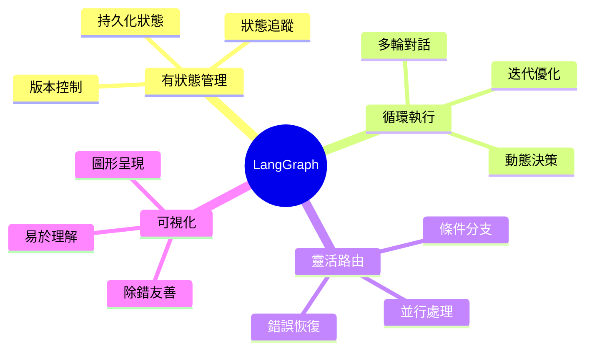
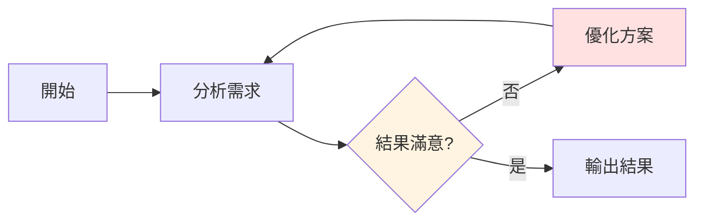
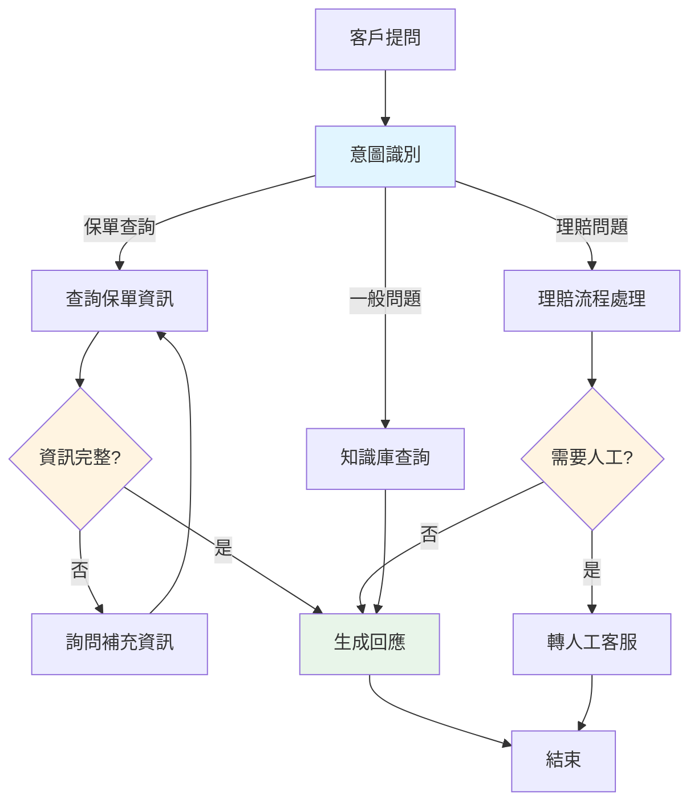
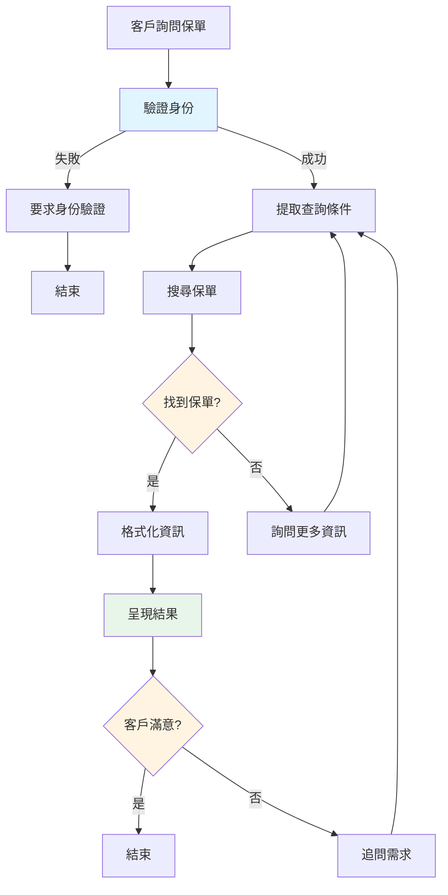

# LangGraph 基礎概念

## 什麼是 LangGraph?

LangGraph 是 LangChain 生態系統中的一個強大框架,專門用於建立**有狀態、多步驟推理的 AI Agent**。它透過圖形化(Graph)的方式來定義和管理 Agent 的工作流程,讓複雜的 AI 應用開發變得更加直觀和可維護。

!!! quote "官方定義"
    LangGraph is a library for building stateful, multi-actor applications with LLMs, built on top of (and intended to be used with) LangChain.

### 核心特性



## 為何需要 LangGraph?

### 傳統 LangChain 的限制

在 LangGraph 出現之前,使用 LangChain 建立複雜 Agent 時會遇到一些挑戰:

```python
# 傳統 LangChain Agent 的問題
from langchain.agents import AgentExecutor, create_openai_functions_agent

# ❌ 問題 1: 難以實現複雜的多步驟邏輯
# ❌ 問題 2: 狀態管理不夠靈活
# ❌ 問題 3: 循環和條件分支處理困難
# ❌ 問題 4: 除錯和追蹤不夠直觀

agent_executor = AgentExecutor(
    agent=agent,
    tools=tools,
    # 只能設定簡單的參數,無法實現複雜邏輯
    max_iterations=5,
    verbose=True
)
```

### LangGraph 的優勢

```python
# ✅ LangGraph 的解決方案
from langgraph.graph import StateGraph, END
from typing import TypedDict, Annotated

# 清晰定義狀態結構
class AgentState(TypedDict):
    messages: list
    current_step: str
    retry_count: int
    result: dict

# 透過圖形定義複雜流程
workflow = StateGraph(AgentState)
workflow.add_node("analyze", analyze_node)
workflow.add_node("process", process_node)
workflow.add_node("validate", validate_node)

# 靈活的條件路由
workflow.add_conditional_edges(
    "analyze",
    route_function,
    {
        "process": "process",
        "end": END
    }
)

# 易於除錯和視覺化
app = workflow.compile()
```

## LangGraph 解決的核心問題

### 1. 有狀態管理 (Stateful)

傳統的 Chain 通常是無狀態的,而 LangGraph 提供了強大的狀態管理能力:

```python
from typing import TypedDict, Annotated
from operator import add

# 定義可累加的狀態
class ConversationState(TypedDict):
    # 使用 Annotated 定義如何更新狀態
    messages: Annotated[list, add]  # 訊息會累加
    user_info: dict  # 使用者資訊會被覆蓋
    context: Annotated[list, add]  # 上下文會累加

# 狀態會在整個流程中保持和更新
```

!!! tip "狀態管理的重要性"
    在實際應用中,例如客戶服務 Agent,需要記住:

    - 對話歷史
    - 客戶資料
    - 查詢結果
    - 處理進度

    這些都需要有效的狀態管理機制。

### 2. 循環執行 (Cycles)

支援循環和迭代,Agent 可以多次嘗試和優化結果:



```python
# 實現循環邏輯
def should_continue(state: AgentState) -> str:
    """決定是否繼續優化"""
    if state["quality_score"] >= 0.8:
        return "end"
    elif state["retry_count"] >= 3:
        return "end"
    else:
        return "optimize"

workflow.add_conditional_edges(
    "validate",
    should_continue,
    {
        "optimize": "analyze",  # 回到分析步驟
        "end": END
    }
)
```

### 3. 靈活路由 (Conditional Routing)

根據狀態動態決定下一步執行哪個節點:

```python
def route_by_intent(state: AgentState) -> str:
    """根據使用者意圖路由"""
    intent = state["user_intent"]

    if intent == "查詢保單":
        return "policy_search"
    elif intent == "理賠申請":
        return "claim_process"
    elif intent == "產品諮詢":
        return "product_recommend"
    else:
        return "general_qa"

workflow.add_conditional_edges(
    "intent_recognition",
    route_by_intent,
    {
        "policy_search": "policy_node",
        "claim_process": "claim_node",
        "product_recommend": "recommend_node",
        "general_qa": "qa_node"
    }
)
```

## 實際應用場景

### 場景 1: 智能客服 Agent



### 場景 2: 文件處理流程

```python
from langgraph.graph import StateGraph, END
from typing import TypedDict

class DocumentState(TypedDict):
    """文件處理狀態"""
    raw_text: str
    doc_type: str  # 保單、理賠單、申請書
    extracted_data: dict
    validation_errors: list
    status: str

# 建立工作流程
workflow = StateGraph(DocumentState)

# 節點定義
def classify_document(state: DocumentState) -> DocumentState:
    """文件分類"""
    # 使用 LLM 分類文件類型
    doc_type = llm_classifier(state["raw_text"])
    return {"doc_type": doc_type}

def extract_info(state: DocumentState) -> DocumentState:
    """資訊提取"""
    # 根據文件類型提取不同欄位
    if state["doc_type"] == "保單":
        data = extract_policy_info(state["raw_text"])
    elif state["doc_type"] == "理賠單":
        data = extract_claim_info(state["raw_text"])
    return {"extracted_data": data}

def validate_data(state: DocumentState) -> DocumentState:
    """資料驗證"""
    errors = []
    # 驗證必填欄位
    if not state["extracted_data"].get("policy_number"):
        errors.append("缺少保單號碼")
    return {"validation_errors": errors}

# 添加節點
workflow.add_node("classify", classify_document)
workflow.add_node("extract", extract_info)
workflow.add_node("validate", validate_data)

# 設定流程
workflow.set_entry_point("classify")
workflow.add_edge("classify", "extract")
workflow.add_edge("extract", "validate")

# 條件結束
def should_retry(state: DocumentState) -> str:
    if state["validation_errors"]:
        return "extract"  # 重新提取
    return END

workflow.add_conditional_edges("validate", should_retry)

# 編譯執行
app = workflow.compile()
```

## LangGraph 核心概念預覽

在後續章節中,我們會深入學習這些核心概念:

### 1. Graph (圖)

圖是整個工作流程的容器,定義了 Agent 的執行邏輯:

```python
from langgraph.graph import StateGraph

# 建立圖
workflow = StateGraph(StateType)

# 添加節點和邊
workflow.add_node("node1", function1)
workflow.add_edge("node1", "node2")

# 編譯成可執行的應用
app = workflow.compile()
```

### 2. State (狀態)

狀態是在節點之間傳遞的資料結構:

```python
from typing import TypedDict, Annotated
from operator import add

class MyState(TypedDict):
    messages: Annotated[list, add]  # 累加
    count: int  # 覆蓋
    metadata: dict  # 覆蓋
```

### 3. Node (節點)

節點是執行具體邏輯的函數:

```python
def my_node(state: MyState) -> MyState:
    """節點函數接收狀態,返回更新的狀態"""
    # 執行邏輯
    result = process(state)

    # 返回要更新的狀態
    return {
        "messages": [result],
        "count": state["count"] + 1
    }
```

### 4. Edge (邊)

邊定義了節點之間的連接關係:

```python
# 固定邊
workflow.add_edge("node1", "node2")

# 條件邊
workflow.add_conditional_edges(
    "node1",
    routing_function,
    {
        "path_a": "node2",
        "path_b": "node3"
    }
)
```

## 簡單範例:待辦事項 Agent

讓我們透過一個簡單的例子來理解 LangGraph:

```python
from langgraph.graph import StateGraph, END
from typing import TypedDict
from langchain_openai import ChatOpenAI

# 1. 定義狀態
class TodoState(TypedDict):
    task: str
    priority: str
    status: str
    notes: list

# 2. 定義節點函數
def analyze_task(state: TodoState) -> TodoState:
    """分析任務優先級"""
    llm = ChatOpenAI(model="gpt-4")

    prompt = f"分析這個任務的優先級(高/中/低): {state['task']}"
    priority = llm.invoke(prompt).content

    return {"priority": priority.strip()}

def create_plan(state: TodoState) -> TodoState:
    """建立執行計畫"""
    llm = ChatOpenAI(model="gpt-4")

    prompt = f"""
    為以下任務建立執行計畫:
    任務: {state['task']}
    優先級: {state['priority']}
    """
    plan = llm.invoke(prompt).content

    return {
        "notes": [plan],
        "status": "planned"
    }

# 3. 建立工作流程
workflow = StateGraph(TodoState)

# 添加節點
workflow.add_node("analyze", analyze_task)
workflow.add_node("plan", create_plan)

# 設定流程
workflow.set_entry_point("analyze")
workflow.add_edge("analyze", "plan")
workflow.add_edge("plan", END)

# 4. 編譯和執行
app = workflow.compile()

# 5. 執行
result = app.invoke({
    "task": "完成 Q1 季度報告",
    "status": "pending",
    "notes": []
})

print(f"優先級: {result['priority']}")
print(f"狀態: {result['status']}")
print(f"計畫: {result['notes'][0]}")
```

輸出範例:

```
優先級: 高
狀態: planned
計畫:
1. 收集 Q1 各部門數據 (1-3天)
2. 分析關鍵指標和趨勢 (2-3天)
3. 撰寫報告初稿 (3-4天)
4. 內部審核和修訂 (1-2天)
5. 最終定稿並提交 (1天)

預計完成時間: 8-13 個工作天
```

## 與傳統程式設計的對比

### 傳統方式

```python
# 傳統的程序式編程
def process_customer_request(request):
    # 步驟 1
    intent = classify_intent(request)

    # 步驟 2
    if intent == "query":
        data = query_database(request)
    elif intent == "complaint":
        data = process_complaint(request)

    # 步驟 3
    response = generate_response(data)

    return response

# ❌ 缺點:
# - 難以處理複雜分支
# - 狀態管理混亂
# - 除錯困難
# - 難以擴展和維護
```

### LangGraph 方式

```python
# LangGraph 的圖形化編程
workflow = StateGraph(RequestState)

# 定義清晰的節點
workflow.add_node("classify", classify_intent_node)
workflow.add_node("query", query_database_node)
workflow.add_node("complaint", process_complaint_node)
workflow.add_node("respond", generate_response_node)

# 清晰的路由邏輯
workflow.add_conditional_edges(
    "classify",
    route_by_intent,
    {
        "query": "query",
        "complaint": "complaint"
    }
)

# ✅ 優點:
# - 流程清晰可視化
# - 狀態管理明確
# - 易於除錯和測試
# - 模組化易擴展
```

## LangGraph 的應用領域

### 1. 客戶服務 🤝

```python
# 智能客服 Agent
- 多輪對話管理
- 意圖識別和路由
- 知識庫查詢
- 人工介入機制
```

### 2. 資料處理 📊

```python
# 文件處理 Agent
- 文件分類
- 資訊提取
- 資料驗證
- 結構化輸出
```

### 3. 決策支援 💡

```python
# 決策輔助 Agent
- 多步驟分析
- 方案比較
- 風險評估
- 建議生成
```

### 4. 自動化流程 ⚙️

```python
# 流程自動化 Agent
- 審批流程
- 資料同步
- 報表生成
- 通知發送
```

## 國泰人壽應用案例

### 案例:保單查詢助手



實際實作會在第 7-9 章詳細說明。

## 重點整理

1. **LangGraph 是什麼**
   - 用於建立有狀態、多步驟 AI Agent 的框架
   - 透過圖形化方式定義工作流程
   - 是 LangChain 生態系統的一部分

2. **核心優勢**
   - ✅ 有狀態管理:持久化追蹤對話和上下文
   - ✅ 支援循環:可以多次迭代優化結果
   - ✅ 靈活路由:動態決定執行路徑
   - ✅ 易於除錯:圖形化呈現,清晰直觀

3. **主要組成**
   - **Graph**:工作流程容器
   - **State**:節點間傳遞的資料
   - **Node**:執行具體邏輯的函數
   - **Edge**:連接節點的路徑

4. **適用場景**
   - 需要多步驟推理的應用
   - 需要保持對話狀態的 Agent
   - 複雜的決策流程
   - 需要人機協作的場景

5. **與 LangChain 的關係**
   - 建立在 LangChain 之上
   - 專注於複雜的 Agent 工作流程
   - 可以整合 LangChain 的所有組件
   - 下一章會詳細說明

## 練習建議

### 練習 1: 環境設定

```bash
# 安裝必要套件
pip install langgraph langchain langchain-openai

# 設定 API Key
export OPENAI_API_KEY="your-key-here"
```

### 練習 2: 執行簡單範例

複製本章的「待辦事項 Agent」範例,修改為:

```python
# 改成「會議安排 Agent」
- 分析會議主題
- 建議適合的參與人員
- 推薦會議時間
- 生成會議議程
```

### 練習 3: 思考應用場景

思考你的工作中哪些流程可以用 LangGraph 自動化:

- 需要哪些步驟?
- 有哪些分支判斷?
- 需要保存什麼狀態?
- 是否需要循環處理?

## 常見問題

### Q1: LangGraph 和 LangChain 有什麼不同?

**A:**
- **LangChain**:提供基礎組件(LLM、Prompt、Chain、Tools)
- **LangGraph**:在 LangChain 之上,專注於複雜的有狀態工作流程
- **關係**:LangGraph 使用 LangChain 的組件,但提供更強大的流程控制

詳細說明請見第 3 章。

### Q2: 什麼時候應該使用 LangGraph?

**A:** 當你的應用需要:
- 多步驟推理和決策
- 保持對話狀態和上下文
- 複雜的條件分支
- 循環和迭代
- 人機協作

### Q3: LangGraph 的學習曲線陡峭嗎?

**A:**
- 如果熟悉 LangChain:很容易上手
- 如果是新手:建議先了解 LangChain 基礎
- 核心概念簡單:Graph、State、Node、Edge
- 本課程會循序漸進引導

### Q4: 可以用於生產環境嗎?

**A:** 可以,但需要注意:
- 錯誤處理和重試機制(第 11 章)
- 效能優化(第 12 章)
- 安全性考量
- 充分的測試

## 下一步

恭喜完成第一章!現在您已經了解:

- ✅ LangGraph 的基本概念
- ✅ 為什麼需要 LangGraph
- ✅ LangGraph 解決的核心問題
- ✅ 實際應用場景

在下一章中,我們將深入學習 LangGraph 的核心組件:Node、Edge 和 State,並了解如何使用它們建立複雜的工作流程。

<div style="text-align: center; margin: 2em 0;">
    <a href="../02-core-components/" style="
        display: inline-block;
        padding: 12px 24px;
        background-color: #2196F3;
        color: white;
        text-decoration: none;
        border-radius: 4px;
        font-weight: bold;
    ">
        下一章:核心組件介紹 →
    </a>
</div>
