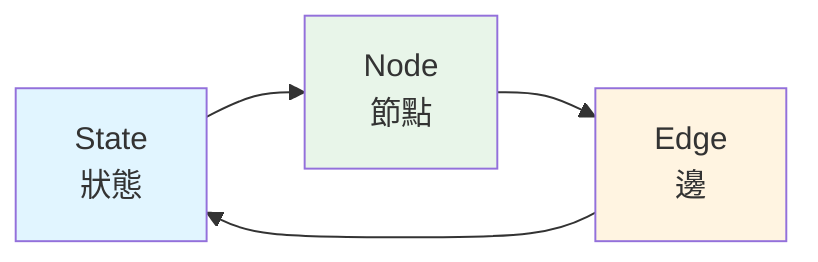
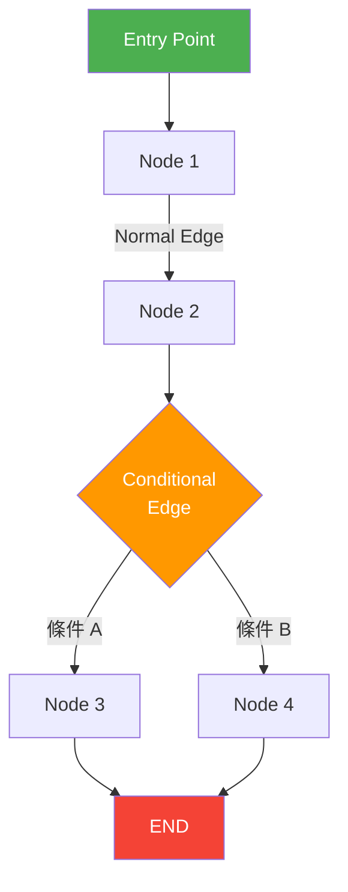
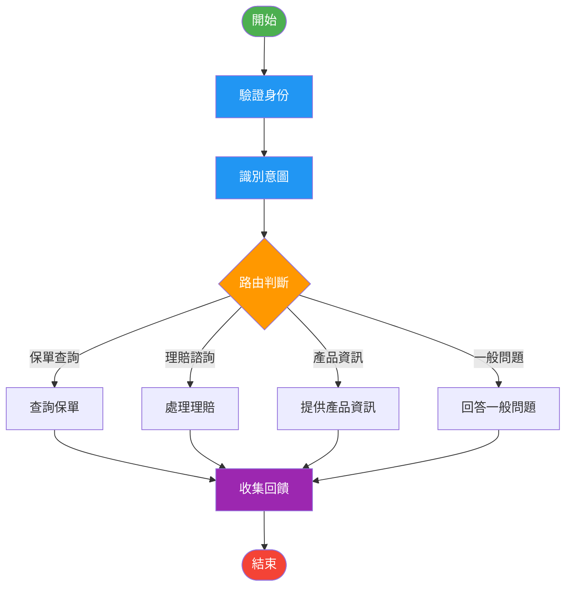
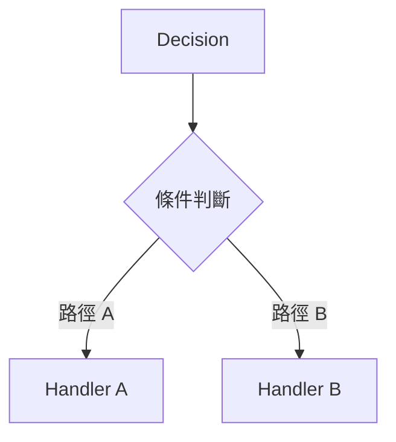
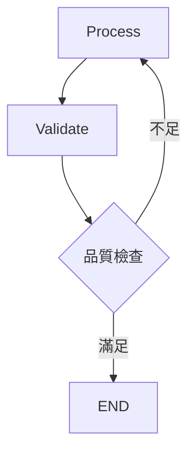

# 核心組件介紹

## 概述

LangGraph 的強大之處在於其簡單而靈活的核心組件。本章將深入介紹三個最重要的概念:**State(狀態)**、**Node(節點)** 和 **Edge(邊)**,以及如何組合它們建立複雜的 Agent 工作流程。



!!! tip "核心三要素"
    - **State**:資料的容器,在節點間傳遞
    - **Node**:處理邏輯的函數,轉換狀態
    - **Edge**:連接節點的路徑,控制流程

## State (狀態)

### 什麼是 State?

State 是在整個工作流程中傳遞和更新的資料結構。它記錄了 Agent 的「記憶」和「上下文」。

```python
from typing import TypedDict, Annotated
from operator import add

# 定義狀態結構
class AgentState(TypedDict):
    """
    AgentState 定義了在工作流程中傳遞的所有資料
    """
    # 對話訊息列表
    messages: Annotated[list, add]  # 使用 add 表示累加

    # 當前步驟
    current_step: str  # 直接覆蓋

    # 使用者資訊
    user_info: dict  # 直接覆蓋

    # 錯誤計數
    error_count: int  # 直接覆蓋
```

### State 的更新機制

LangGraph 提供兩種狀態更新方式:

#### 1. 覆蓋更新 (Replace)

預設行為,新值會覆蓋舊值:

```python
from typing import TypedDict

class SimpleState(TypedDict):
    counter: int
    name: str

# 節點函數
def increment(state: SimpleState) -> SimpleState:
    # 返回的值會覆蓋原有值
    return {
        "counter": state["counter"] + 1,
        "name": "updated"
    }

# 執行前: {"counter": 0, "name": "original"}
# 執行後: {"counter": 1, "name": "updated"}
```

#### 2. 累加更新 (Add)

使用 `Annotated` 指定累加行為:

```python
from typing import TypedDict, Annotated
from operator import add

class ConversationState(TypedDict):
    # 訊息會累加,不會被覆蓋
    messages: Annotated[list, add]
    # 計數會覆蓋
    message_count: int

def add_message(state: ConversationState) -> ConversationState:
    new_msg = {"role": "assistant", "content": "你好!"}

    return {
        "messages": [new_msg],  # 會加到現有訊息後面
        "message_count": len(state["messages"]) + 1  # 會覆蓋
    }

# 執行前: {"messages": [{"role": "user", "content": "嗨"}], "message_count": 1}
# 執行後: {"messages": [{"role": "user", "content": "嗨"},
#                       {"role": "assistant", "content": "你好!"}],
#          "message_count": 2}
```

### State 的最佳實踐

```python
from typing import TypedDict, Annotated, Optional
from operator import add
from datetime import datetime

class ProductionState(TypedDict):
    """生產環境的狀態設計範例"""

    # 1. 對話歷史 - 使用累加
    messages: Annotated[list[dict], add]

    # 2. 使用者資訊 - 使用覆蓋
    user_id: str
    user_name: str
    user_role: str

    # 3. 當前會話資訊 - 使用覆蓋
    session_id: str
    timestamp: datetime

    # 4. 處理狀態 - 使用覆蓋
    current_step: str
    is_processing: bool

    # 5. 累計資訊 - 使用累加
    search_results: Annotated[list[dict], add]
    execution_logs: Annotated[list[str], add]

    # 6. 錯誤處理 - 使用覆蓋
    error_count: int
    last_error: Optional[str]

    # 7. 結果資料 - 使用覆蓋
    final_result: Optional[dict]
```

!!! warning "State 設計注意事項"
    1. **避免存放大型物件**:State 會在節點間傳遞,太大會影響效能
    2. **使用明確的型別**:有助於除錯和維護
    3. **區分累加和覆蓋**:根據業務邏輯選擇合適的更新方式
    4. **保持扁平結構**:避免過深的巢狀結構

## Node (節點)

### 什麼是 Node?

Node 是執行具體邏輯的函數,它接收當前 State,執行處理,然後返回更新的 State。

```python
def my_node(state: AgentState) -> AgentState:
    """
    節點函數的標準結構

    Args:
        state: 當前狀態

    Returns:
        更新的狀態(只需要返回變更的欄位)
    """
    # 1. 從狀態中讀取需要的資料
    user_input = state["messages"][-1]["content"]

    # 2. 執行業務邏輯
    result = process(user_input)

    # 3. 返回要更新的狀態
    return {
        "messages": [{"role": "assistant", "content": result}],
        "current_step": "completed"
    }
```

### Node 的類型

#### 1. 處理節點 (Processing Node)

執行主要業務邏輯:

```python
from langchain_openai import ChatOpenAI

def analyze_sentiment(state: ConversationState) -> ConversationState:
    """情感分析節點"""
    llm = ChatOpenAI(model="gpt-4")

    # 取得最後一則使用者訊息
    last_message = state["messages"][-1]["content"]

    # LLM 分析情感
    prompt = f"分析以下文字的情感(正面/負面/中性):\n{last_message}"
    sentiment = llm.invoke(prompt).content

    # 更新狀態
    return {
        "sentiment": sentiment,
        "messages": [{"role": "system", "content": f"情感: {sentiment}"}]
    }
```

#### 2. 決策節點 (Decision Node)

根據條件設定標記,供後續路由使用:

```python
def check_quality(state: AgentState) -> AgentState:
    """品質檢查節點"""
    result = state["result"]

    # 計算品質分數
    quality_score = calculate_quality(result)

    # 設定決策標記
    return {
        "quality_score": quality_score,
        "needs_improvement": quality_score < 0.8,
        "current_step": "quality_checked"
    }
```

#### 3. 整合節點 (Integration Node)

與外部系統或 API 互動:

```python
import requests

def query_database(state: AgentState) -> AgentState:
    """資料庫查詢節點"""
    policy_number = state["policy_number"]

    # 呼叫內部 API
    response = requests.get(
        f"https://api.company.com/policy/{policy_number}",
        headers={"Authorization": f"Bearer {API_KEY}"}
    )

    if response.status_code == 200:
        policy_data = response.json()
        return {
            "policy_data": policy_data,
            "error_count": 0,
            "current_step": "data_retrieved"
        }
    else:
        return {
            "error_count": state["error_count"] + 1,
            "last_error": f"API Error: {response.status_code}",
            "current_step": "error"
        }
```

#### 4. 格式化節點 (Formatting Node)

準備輸出格式:

```python
def format_response(state: AgentState) -> AgentState:
    """格式化回應節點"""
    data = state["policy_data"]

    # 格式化輸出
    formatted_text = f"""
保單資訊:
- 保單號碼: {data['policy_number']}
- 保險人: {data['holder_name']}
- 保額: NT$ {data['amount']:,}
- 有效期: {data['start_date']} 至 {data['end_date']}
"""

    return {
        "final_result": formatted_text,
        "messages": [{"role": "assistant", "content": formatted_text}]
    }
```

### Node 的最佳實踐

```python
from typing import TypedDict
from langchain_openai import ChatOpenAI
import logging

# 設定日誌
logger = logging.getLogger(__name__)

def robust_node(state: AgentState) -> AgentState:
    """健壯的節點設計範例"""

    # 1. 輸入驗證
    if not state.get("user_input"):
        logger.warning("Missing user_input in state")
        return {
            "error_count": state.get("error_count", 0) + 1,
            "last_error": "Missing user input"
        }

    # 2. 錯誤處理
    try:
        # 業務邏輯
        llm = ChatOpenAI(model="gpt-4", timeout=30)
        result = llm.invoke(state["user_input"])

        # 3. 日誌記錄
        logger.info(f"Successfully processed: {state['user_input'][:50]}...")

        # 4. 返回更新
        return {
            "result": result.content,
            "current_step": "processed",
            "error_count": 0  # 重設錯誤計數
        }

    except Exception as e:
        # 5. 錯誤處理
        logger.error(f"Node error: {str(e)}")
        return {
            "error_count": state.get("error_count", 0) + 1,
            "last_error": str(e),
            "current_step": "error"
        }
```

## Edge (邊)

### 什麼是 Edge?

Edge 定義了節點之間的連接關係和執行順序。LangGraph 提供三種類型的邊:



### 1. 一般邊 (Normal Edge)

固定的連接關係:

```python
from langgraph.graph import StateGraph, END

workflow = StateGraph(AgentState)

# 添加節點
workflow.add_node("step1", step1_function)
workflow.add_node("step2", step2_function)
workflow.add_node("step3", step3_function)

# 添加固定的邊
workflow.add_edge("step1", "step2")  # step1 完成後執行 step2
workflow.add_edge("step2", "step3")  # step2 完成後執行 step3
workflow.add_edge("step3", END)       # step3 完成後結束
```

### 2. 條件邊 (Conditional Edge)

根據狀態動態決定下一步:

```python
def route_based_on_quality(state: AgentState) -> str:
    """
    路由函數:根據狀態決定下一個節點

    Returns:
        下一個節點的名稱
    """
    if state["quality_score"] >= 0.9:
        return "excellent_path"
    elif state["quality_score"] >= 0.7:
        return "good_path"
    else:
        return "needs_improvement"

# 添加條件邊
workflow.add_conditional_edges(
    "check_quality",  # 從這個節點出發
    route_based_on_quality,  # 路由函數
    {
        # 映射:路由函數返回值 -> 目標節點
        "excellent_path": "finalize",
        "good_path": "minor_adjustments",
        "needs_improvement": "major_revision"
    }
)
```

### 3. 入口點 (Entry Point)

定義工作流程的起點:

```python
workflow = StateGraph(AgentState)

workflow.add_node("start", start_function)
workflow.add_node("process", process_function)

# 設定入口點
workflow.set_entry_point("start")

# 連接後續節點
workflow.add_edge("start", "process")
```

### 完整範例:客戶服務流程

```python
from langgraph.graph import StateGraph, END
from typing import TypedDict, Annotated
from operator import add

# 1. 定義狀態
class CustomerServiceState(TypedDict):
    messages: Annotated[list[dict], add]
    user_intent: str
    user_verified: bool
    query_result: dict
    satisfaction_score: float

# 2. 定義節點函數
def verify_identity(state: CustomerServiceState) -> CustomerServiceState:
    """驗證使用者身份"""
    # 模擬身份驗證
    verified = True  # 實際會呼叫驗證 API

    return {
        "user_verified": verified,
        "messages": [{"role": "system", "content": "身份驗證完成"}]
    }

def recognize_intent(state: CustomerServiceState) -> CustomerServiceState:
    """識別使用者意圖"""
    from langchain_openai import ChatOpenAI

    llm = ChatOpenAI(model="gpt-4")
    user_message = state["messages"][-1]["content"]

    prompt = f"""
    分析使用者意圖,回答以下其中一個:
    - policy_query (保單查詢)
    - claim_inquiry (理賠諮詢)
    - product_info (產品資訊)
    - general_question (一般問題)

    使用者訊息: {user_message}
    只回答意圖類別,不要其他說明。
    """

    intent = llm.invoke(prompt).content.strip()

    return {
        "user_intent": intent,
        "messages": [{"role": "system", "content": f"意圖: {intent}"}]
    }

def query_policy(state: CustomerServiceState) -> CustomerServiceState:
    """查詢保單資訊"""
    # 模擬資料庫查詢
    result = {
        "policy_number": "P123456",
        "status": "active",
        "coverage": "1,000,000"
    }

    return {
        "query_result": result,
        "messages": [{"role": "assistant", "content": f"找到保單: {result}"}]
    }

def handle_claim(state: CustomerServiceState) -> CustomerServiceState:
    """處理理賠諮詢"""
    return {
        "messages": [{"role": "assistant", "content": "理賠流程說明..."}]
    }

def provide_product_info(state: CustomerServiceState) -> CustomerServiceState:
    """提供產品資訊"""
    return {
        "messages": [{"role": "assistant", "content": "產品資訊..."}]
    }

def answer_general(state: CustomerServiceState) -> CustomerServiceState:
    """回答一般問題"""
    return {
        "messages": [{"role": "assistant", "content": "一般回答..."}]
    }

def collect_feedback(state: CustomerServiceState) -> CustomerServiceState:
    """收集回饋"""
    # 模擬收集滿意度
    return {
        "satisfaction_score": 4.5,
        "messages": [{"role": "system", "content": "感謝您的回饋!"}]
    }

# 3. 建立工作流程
workflow = StateGraph(CustomerServiceState)

# 添加所有節點
workflow.add_node("verify", verify_identity)
workflow.add_node("intent", recognize_intent)
workflow.add_node("policy", query_policy)
workflow.add_node("claim", handle_claim)
workflow.add_node("product", provide_product_info)
workflow.add_node("general", answer_general)
workflow.add_node("feedback", collect_feedback)

# 4. 設定入口點
workflow.set_entry_point("verify")

# 5. 添加邊
# 驗證後識別意圖
workflow.add_edge("verify", "intent")

# 6. 根據意圖路由
def route_by_intent(state: CustomerServiceState) -> str:
    """根據意圖路由到不同處理節點"""
    intent = state["user_intent"]

    intent_mapping = {
        "policy_query": "policy",
        "claim_inquiry": "claim",
        "product_info": "product",
        "general_question": "general"
    }

    return intent_mapping.get(intent, "general")

workflow.add_conditional_edges(
    "intent",
    route_by_intent,
    {
        "policy": "policy",
        "claim": "claim",
        "product": "product",
        "general": "general"
    }
)

# 7. 所有處理完成後收集回饋
workflow.add_edge("policy", "feedback")
workflow.add_edge("claim", "feedback")
workflow.add_edge("product", "feedback")
workflow.add_edge("general", "feedback")

# 8. 結束
workflow.add_edge("feedback", END)

# 9. 編譯
app = workflow.compile()

# 10. 執行
result = app.invoke({
    "messages": [{"role": "user", "content": "我想查詢我的保單"}],
    "user_verified": False,
    "satisfaction_score": 0.0
})

print("最終狀態:", result)
```

### 執行流程視覺化



## 組件組合模式

### 模式 1:線性流程

```python
# 簡單的順序執行
workflow.set_entry_point("step1")
workflow.add_edge("step1", "step2")
workflow.add_edge("step2", "step3")
workflow.add_edge("step3", END)
```


### 模式 2:條件分支

```python
# 根據條件選擇不同路徑
workflow.add_conditional_edges(
    "decision",
    decision_function,
    {
        "path_a": "handler_a",
        "path_b": "handler_b"
    }
)
```



### 模式 3:循環處理

```python
# 迭代優化直到滿足條件
def should_continue(state):
    if state["quality"] > 0.8 or state["attempts"] >= 3:
        return "end"
    return "retry"

workflow.add_conditional_edges(
    "validate",
    should_continue,
    {
        "retry": "process",  # 回到處理步驟
        "end": END
    }
)
```



### 模式 4:並行後合併

雖然 LangGraph 本身不直接支援並行,但可以透過設計實現:

```python
def parallel_processor(state: AgentState) -> AgentState:
    """在單一節點中並行處理多個任務"""
    from concurrent.futures import ThreadPoolExecutor

    def task1():
        return process_a(state)

    def task2():
        return process_b(state)

    with ThreadPoolExecutor(max_workers=2) as executor:
        future1 = executor.submit(task1)
        future2 = executor.submit(task2)

        result1 = future1.result()
        result2 = future2.result()

    # 合併結果
    return {
        "result_a": result1,
        "result_b": result2
    }
```

## 實戰範例:文件處理流程

```python
from langgraph.graph import StateGraph, END
from typing import TypedDict, Annotated, Optional
from operator import add
from langchain_openai import ChatOpenAI

# 1. 定義狀態
class DocumentProcessingState(TypedDict):
    # 原始文件
    raw_text: str

    # 文件類型
    doc_type: Optional[str]

    # 提取的資料
    extracted_fields: dict

    # 驗證結果
    validation_errors: Annotated[list[str], add]

    # 處理狀態
    retry_count: int
    status: str

# 2. 節點:文件分類
def classify_document(state: DocumentProcessingState) -> DocumentProcessingState:
    """使用 LLM 分類文件"""
    llm = ChatOpenAI(model="gpt-4")

    prompt = f"""
    分析以下文件並分類:
    - policy_application (保單申請書)
    - claim_form (理賠申請表)
    - id_document (身份證明文件)

    文件內容:
    {state['raw_text'][:500]}

    只回答文件類型,不要其他說明。
    """

    doc_type = llm.invoke(prompt).content.strip()

    return {
        "doc_type": doc_type,
        "status": "classified"
    }

# 3. 節點:資訊提取
def extract_information(state: DocumentProcessingState) -> DocumentProcessingState:
    """根據文件類型提取欄位"""
    llm = ChatOpenAI(model="gpt-4")

    # 根據文件類型定義要提取的欄位
    field_definitions = {
        "policy_application": [
            "applicant_name",
            "id_number",
            "policy_type",
            "coverage_amount"
        ],
        "claim_form": [
            "policy_number",
            "claim_amount",
            "incident_date",
            "description"
        ],
        "id_document": [
            "name",
            "id_number",
            "birth_date"
        ]
    }

    fields = field_definitions.get(state["doc_type"], [])

    prompt = f"""
    從以下文件中提取這些欄位: {', '.join(fields)}

    文件內容:
    {state['raw_text']}

    以 JSON 格式回答,欄位名稱使用英文。
    """

    import json
    extracted = json.loads(llm.invoke(prompt).content)

    return {
        "extracted_fields": extracted,
        "status": "extracted"
    }

# 4. 節點:資料驗證
def validate_data(state: DocumentProcessingState) -> DocumentProcessingState:
    """驗證提取的資料"""
    errors = []
    fields = state["extracted_fields"]

    # 驗證必填欄位
    if state["doc_type"] == "policy_application":
        required = ["applicant_name", "id_number", "policy_type"]
        for field in required:
            if not fields.get(field):
                errors.append(f"缺少必填欄位: {field}")

    # 驗證格式
    if "id_number" in fields:
        id_num = fields["id_number"]
        if not (len(id_num) == 10 and id_num[0].isalpha()):
            errors.append("身份證號格式錯誤")

    return {
        "validation_errors": errors,
        "status": "validated" if not errors else "validation_failed"
    }

# 5. 節點:人工審核
def human_review(state: DocumentProcessingState) -> DocumentProcessingState:
    """標記需要人工審核"""
    return {
        "status": "pending_human_review",
        "validation_errors": ["需要人工審核"]
    }

# 6. 路由函數
def route_after_validation(state: DocumentProcessingState) -> str:
    """決定驗證後的路徑"""
    if not state["validation_errors"]:
        return "success"

    # 重試次數限制
    if state["retry_count"] >= 2:
        return "human_review"

    return "retry"

# 7. 建立工作流程
workflow = StateGraph(DocumentProcessingState)

# 添加節點
workflow.add_node("classify", classify_document)
workflow.add_node("extract", extract_information)
workflow.add_node("validate", validate_data)
workflow.add_node("human", human_review)

# 設定流程
workflow.set_entry_point("classify")
workflow.add_edge("classify", "extract")
workflow.add_edge("extract", "validate")

# 條件路由
workflow.add_conditional_edges(
    "validate",
    route_after_validation,
    {
        "success": END,
        "retry": "extract",  # 重新提取
        "human_review": "human"
    }
)

workflow.add_edge("human", END)

# 編譯
document_processor = workflow.compile()

# 使用範例
result = document_processor.invoke({
    "raw_text": """
    保單申請書
    申請人姓名:王大明
    身份證號:A123456789
    申請保險:終身壽險
    保額:3,000,000元
    """,
    "retry_count": 0,
    "validation_errors": [],
    "extracted_fields": {}
})

print(f"處理狀態: {result['status']}")
print(f"提取欄位: {result['extracted_fields']}")
print(f"驗證錯誤: {result['validation_errors']}")
```

## 重點整理

### State (狀態)

1. **資料容器**:在節點間傳遞資料
2. **兩種更新方式**:
   - 覆蓋(預設):新值取代舊值
   - 累加(使用 `Annotated[type, add]`):新值加到舊值後面
3. **設計原則**:
   - 使用 `TypedDict` 定義清晰的結構
   - 避免存放大型物件
   - 區分累加和覆蓋欄位

### Node (節點)

1. **處理單元**:執行具體邏輯的函數
2. **函數簽名**:`def node(state: StateType) -> StateType`
3. **返回值**:只需返回要更新的欄位
4. **類型**:
   - 處理節點:執行主要邏輯
   - 決策節點:設定判斷標記
   - 整合節點:與外部系統互動
   - 格式化節點:準備輸出

### Edge (邊)

1. **連接關係**:定義節點間的執行順序
2. **三種類型**:
   - 入口點:`set_entry_point()`
   - 一般邊:`add_edge(from, to)`
   - 條件邊:`add_conditional_edges(from, router, mapping)`
3. **特殊節點**:`END` 表示結束

### 組合模式

1. **線性流程**:順序執行
2. **條件分支**:根據狀態選擇路徑
3. **循環處理**:迭代優化
4. **並行處理**:在節點內部實現

## 練習建議

### 練習 1:設計狀態結構

為以下場景設計合適的 State:

```python
# 場景:智能郵件分類和回覆系統
class EmailState(TypedDict):
    # TODO: 設計狀態結構
    # 考慮:郵件內容、分類結果、回覆草稿、優先級等
    pass
```

### 練習 2:實作節點函數

實作一個完整的節點,包含:
- 輸入驗證
- 錯誤處理
- 日誌記錄
- 返回更新

### 練習 3:建立工作流程

建立一個「會議安排助手」工作流程:
1. 提取會議需求
2. 檢查參與者行程
3. 建議時間
4. 發送邀請
5. 收集回覆

## 常見問題

### Q1: State 可以包含函數嗎?

**A:** 技術上可以,但不建議。State 應該只包含資料,邏輯應該放在 Node 中。

### Q2: Node 可以呼叫其他 Node 嗎?

**A:** 不建議直接呼叫。應該透過 Edge 來連接節點,保持工作流程的清晰性。

### Q3: 如何在 Node 中存取外部資源?

**A:** 可以透過:
1. 在 Node 函數中直接存取(適合簡單情況)
2. 使用依賴注入模式
3. 使用全域配置

### Q4: 條件邊的路由函數可以修改 State 嗎?

**A:** 路由函數應該只讀取 State 並返回路徑名稱,不應該修改 State。狀態修改應該在 Node 中進行。

## 下一步

現在您已經掌握了 LangGraph 的三個核心組件!在下一章,我們將學習 LangGraph 與 LangChain 的關係,以及如何整合 LangChain 的強大功能。

<div style="text-align: center; margin: 2em 0;">
    <a href="../03-langchain-relation/" style="
        display: inline-block;
        padding: 12px 24px;
        background-color: #2196F3;
        color: white;
        text-decoration: none;
        border-radius: 4px;
        font-weight: bold;
    ">
        下一章:與 LangChain 的關係 →
    </a>
</div>
