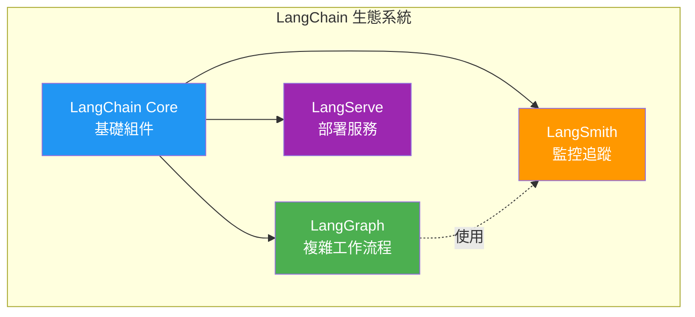
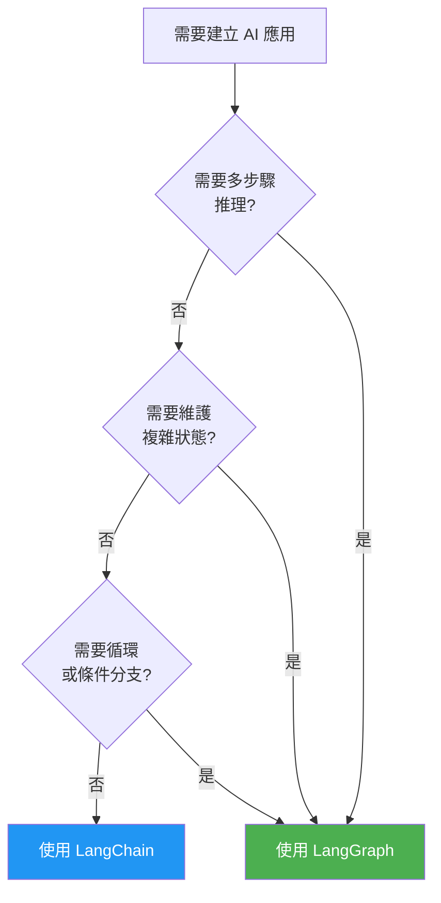

# 與 LangChain 的關係

## 概述

LangGraph 和 LangChain 是什麼關係?這是初學者最常問的問題之一。簡單來說:**LangGraph 建立在 LangChain 之上,專注於構建複雜的有狀態 Agent 工作流程**。



!!! quote "核心定位"
    - **LangChain**:提供 AI 應用的基礎積木
    - **LangGraph**:提供組裝這些積木的高級框架

## LangChain 核心組件回顧

在深入 LangGraph 之前,讓我們快速回顧 LangChain 的核心組件:

### 1. Models (模型)

與各種 LLM 互動的介面:

```python
from langchain_openai import ChatOpenAI
from langchain_anthropic import ChatAnthropic

# OpenAI Models
openai_llm = ChatOpenAI(model="gpt-4")

# Anthropic Models
anthropic_llm = ChatAnthropic(model="claude-3-opus")

# 統一的呼叫介面
response = openai_llm.invoke("你好!")
```

### 2. Prompts (提示詞範本)

結構化的提示詞管理:

```python
from langchain.prompts import ChatPromptTemplate

prompt = ChatPromptTemplate.from_messages([
    ("system", "你是一位{role}。"),
    ("human", "{user_input}")
])

# 格式化提示詞
formatted = prompt.format_messages(
    role="保險顧問",
    user_input="什麼是終身壽險?"
)
```

### 3. Chains (鏈)

將多個組件串接起來:

```python
from langchain.chains import LLMChain

chain = LLMChain(
    llm=openai_llm,
    prompt=prompt
)

result = chain.invoke({
    "role": "保險顧問",
    "user_input": "什麼是終身壽險?"
})
```

### 4. Tools (工具)

讓 LLM 可以呼叫外部功能:

```python
from langchain.tools import Tool

def search_policy(policy_number: str) -> dict:
    """查詢保單資訊"""
    # 實際會連接資料庫
    return {"policy_number": policy_number, "status": "active"}

policy_tool = Tool(
    name="搜尋保單",
    func=search_policy,
    description="根據保單號碼查詢保單資訊"
)
```

### 5. Agents (代理)

自動決定使用哪些工具:

```python
from langchain.agents import create_openai_functions_agent, AgentExecutor

agent = create_openai_functions_agent(
    llm=openai_llm,
    tools=[policy_tool],
    prompt=prompt
)

agent_executor = AgentExecutor(
    agent=agent,
    tools=[policy_tool],
    verbose=True
)
```

## LangChain 的限制

雖然 LangChain 很強大,但在處理複雜場景時會遇到一些挑戰:

### 限制 1:複雜的控制流程

```python
# ❌ LangChain 難以實現的複雜邏輯
# 場景:需要多次驗證和重試的流程

# 想要實現:
# 1. 提取資訊
# 2. 驗證資訊
# 3. 如果驗證失敗,重新提取(最多3次)
# 4. 如果仍失敗,轉人工處理
# 5. 驗證成功後,進行下一步處理

# LangChain 的 AgentExecutor 難以實現這種複雜的條件和循環邏輯
```

### 限制 2:有限的狀態管理

```python
# ❌ LangChain Agent 的狀態管理有限
from langchain.memory import ConversationBufferMemory

memory = ConversationBufferMemory()

# 只能儲存對話歷史,無法靈活管理複雜狀態
# 例如:處理進度、錯誤計數、中間結果等
```

### 限制 3:除錯困難

```python
# ❌ 難以追蹤 Agent 的決策過程
# - Agent 為什麼選擇這個工具?
# - 在哪個步驟出錯?
# - 如何重現問題?
```

## LangGraph 的解決方案

LangGraph 透過圖形化工作流程解決了這些問題:

### 解決方案 1:清晰的控制流程

```python
# ✅ LangGraph 清晰實現複雜邏輯
from langgraph.graph import StateGraph, END

def should_retry(state):
    if state["validation_passed"]:
        return "next_step"
    elif state["retry_count"] < 3:
        return "extract_again"
    else:
        return "human_review"

workflow = StateGraph(State)
workflow.add_node("extract", extract_node)
workflow.add_node("validate", validate_node)
workflow.add_node("next", next_step_node)
workflow.add_node("human", human_review_node)

workflow.add_conditional_edges(
    "validate",
    should_retry,
    {
        "next_step": "next",
        "extract_again": "extract",
        "human_review": "human"
    }
)
```

### 解決方案 2:靈活的狀態管理

```python
# ✅ LangGraph 強大的狀態管理
from typing import TypedDict, Annotated
from operator import add

class RichState(TypedDict):
    # 對話歷史
    messages: Annotated[list, add]

    # 處理進度
    current_step: str
    completed_steps: Annotated[list, add]

    # 錯誤追蹤
    retry_count: int
    errors: Annotated[list, add]

    # 中間結果
    extracted_data: dict
    validation_result: dict

    # 業務資料
    user_info: dict
    query_results: list
```

### 解決方案 3:可視化除錯

```python
# ✅ LangGraph 提供視覺化和追蹤
app = workflow.compile()

# 可以視覺化整個流程
from IPython.display import Image, display
display(Image(app.get_graph().draw_mermaid_png()))

# 整合 LangSmith 追蹤
# 可以看到每個節點的輸入輸出
```

## LangChain + LangGraph 整合

LangGraph 完全相容 LangChain 的所有組件,可以無縫整合使用:

### 整合範例 1:在 Node 中使用 LangChain

```python
from langgraph.graph import StateGraph
from langchain_openai import ChatOpenAI
from langchain.prompts import ChatPromptTemplate
from langchain.output_parsers import PydanticOutputParser
from pydantic import BaseModel, Field

# 1. 定義輸出結構(LangChain)
class PolicyInfo(BaseModel):
    policy_number: str = Field(description="保單號碼")
    holder_name: str = Field(description="保險人姓名")
    policy_type: str = Field(description="保險類型")

# 2. 建立 Parser(LangChain)
parser = PydanticOutputParser(pydantic_object=PolicyInfo)

# 3. 建立 Prompt(LangChain)
prompt = ChatPromptTemplate.from_messages([
    ("system", "從以下文字中提取保單資訊。\n{format_instructions}"),
    ("human", "{text}")
])

# 4. 建立 LLM(LangChain)
llm = ChatOpenAI(model="gpt-4")

# 5. 在 LangGraph Node 中使用
def extract_policy_info(state):
    """使用 LangChain 組件的 LangGraph 節點"""

    # 格式化 Prompt
    messages = prompt.format_messages(
        format_instructions=parser.get_format_instructions(),
        text=state["raw_text"]
    )

    # 呼叫 LLM
    response = llm.invoke(messages)

    # 解析結果
    policy_info = parser.parse(response.content)

    return {
        "policy_number": policy_info.policy_number,
        "holder_name": policy_info.holder_name,
        "policy_type": policy_info.policy_type
    }

# 6. 整合到 LangGraph
workflow = StateGraph(State)
workflow.add_node("extract", extract_policy_info)
```

### 整合範例 2:在 LangGraph 中使用 Tools

```python
from langchain.tools import Tool
from langchain_core.messages import HumanMessage, AIMessage
from langgraph.prebuilt import ToolExecutor

# 1. 定義 LangChain Tools
def search_database(query: str) -> str:
    """搜尋資料庫"""
    # 實際資料庫查詢
    return f"查詢結果: {query}"

def send_email(to: str, subject: str) -> str:
    """發送郵件"""
    return f"已發送郵件給 {to}"

tools = [
    Tool(
        name="search_database",
        func=search_database,
        description="搜尋公司資料庫"
    ),
    Tool(
        name="send_email",
        func=send_email,
        description="發送電子郵件"
    )
]

# 2. 建立 Tool Executor
tool_executor = ToolExecutor(tools)

# 3. 在 LangGraph 中使用
def agent_node(state):
    """決定要使用哪個工具"""
    llm = ChatOpenAI(model="gpt-4")
    llm_with_tools = llm.bind_tools(tools)

    messages = state["messages"]
    response = llm_with_tools.invoke(messages)

    return {"messages": [response]}

def tool_node(state):
    """執行工具"""
    messages = state["messages"]
    last_message = messages[-1]

    # 執行工具呼叫
    if hasattr(last_message, "tool_calls") and last_message.tool_calls:
        tool_call = last_message.tool_calls[0]
        result = tool_executor.invoke(tool_call)
        return {"messages": [result]}

    return {"messages": []}

# 4. 建立 Graph
workflow = StateGraph(MessagesState)
workflow.add_node("agent", agent_node)
workflow.add_node("tools", tool_node)

workflow.add_conditional_edges(
    "agent",
    lambda state: "tools" if state["messages"][-1].tool_calls else END
)
workflow.add_edge("tools", "agent")
```

### 整合範例 3:使用 LangChain 的 Memory

```python
from langchain.memory import ConversationBufferMemory
from langgraph.graph import StateGraph

# 1. 建立 LangChain Memory
memory = ConversationBufferMemory(return_messages=True)

# 2. 在 LangGraph State 中整合
class ConversationState(TypedDict):
    messages: Annotated[list, add]
    memory_context: str

def load_memory_node(state):
    """從 LangChain Memory 載入上下文"""
    history = memory.load_memory_variables({})
    context = "\n".join([
        f"{msg.type}: {msg.content}"
        for msg in history.get("history", [])
    ])

    return {"memory_context": context}

def save_memory_node(state):
    """儲存到 LangChain Memory"""
    for msg in state["messages"]:
        memory.save_context(
            {"input": msg.get("input", "")},
            {"output": msg.get("output", "")}
        )
    return {}

# 3. 整合到工作流程
workflow = StateGraph(ConversationState)
workflow.add_node("load_memory", load_memory_node)
workflow.add_node("process", process_node)
workflow.add_node("save_memory", save_memory_node)

workflow.set_entry_point("load_memory")
workflow.add_edge("load_memory", "process")
workflow.add_edge("process", "save_memory")
workflow.add_edge("save_memory", END)
```

## 何時使用 LangChain vs LangGraph

### 使用 LangChain 的場景

適合簡單、線性的 AI 任務:

```python
# ✅ 適合使用 LangChain
scenarios = [
    "簡單的問答系統",
    "文字摘要生成",
    "單次資料轉換",
    "直接的 RAG 應用",
    "簡單的 Agent(不需複雜決策)"
]

# 範例:簡單 RAG
from langchain.chains import RetrievalQA

qa_chain = RetrievalQA.from_chain_type(
    llm=llm,
    retriever=vectorstore.as_retriever()
)

result = qa_chain.invoke("什麼是終身壽險?")
```

### 使用 LangGraph 的場景

適合複雜、有狀態的 AI 應用:

```python
# ✅ 適合使用 LangGraph
scenarios = [
    "多步驟推理和決策",
    "需要循環和條件分支",
    "複雜的狀態管理",
    "需要人機協作",
    "多輪對話系統",
    "複雜的 Agent 工作流程"
]

# 範例:複雜的客戶服務流程
workflow = StateGraph(State)
workflow.add_node("verify", verify_identity)
workflow.add_node("classify", classify_intent)
workflow.add_node("query", query_data)
workflow.add_node("validate", validate_result)
workflow.add_conditional_edges("validate", should_retry)
```

### 決策流程圖



## 遷移指南:從 LangChain 到 LangGraph

### 遷移範例:Agent Executor

#### 原始 LangChain 程式碼

```python
from langchain.agents import create_openai_functions_agent, AgentExecutor
from langchain.tools import Tool
from langchain_openai import ChatOpenAI

# 定義工具
tools = [
    Tool(
        name="calculator",
        func=lambda x: eval(x),
        description="計算數學表達式"
    )
]

# 建立 Agent
llm = ChatOpenAI(model="gpt-4")
agent = create_openai_functions_agent(llm, tools, prompt)

# 執行
agent_executor = AgentExecutor(
    agent=agent,
    tools=tools,
    max_iterations=5,
    verbose=True
)

result = agent_executor.invoke({"input": "計算 123 * 456"})
```

#### 遷移到 LangGraph

```python
from langgraph.graph import StateGraph, END
from langgraph.prebuilt import ToolExecutor
from typing import TypedDict, Annotated
from operator import add

# 1. 定義狀態
class AgentState(TypedDict):
    messages: Annotated[list, add]
    iterations: int

# 2. 定義節點
def agent_node(state: AgentState):
    llm = ChatOpenAI(model="gpt-4")
    llm_with_tools = llm.bind_tools(tools)

    response = llm_with_tools.invoke(state["messages"])
    return {
        "messages": [response],
        "iterations": state.get("iterations", 0) + 1
    }

def tool_node(state: AgentState):
    tool_executor = ToolExecutor(tools)
    last_message = state["messages"][-1]

    if hasattr(last_message, "tool_calls"):
        results = [tool_executor.invoke(call) for call in last_message.tool_calls]
        return {"messages": results}

    return {}

# 3. 建立工作流程
workflow = StateGraph(AgentState)
workflow.add_node("agent", agent_node)
workflow.add_node("tools", tool_node)

# 4. 定義路由
def should_continue(state: AgentState):
    messages = state["messages"]
    last_message = messages[-1]

    # 檢查是否超過最大迭代次數
    if state.get("iterations", 0) >= 5:
        return "end"

    # 檢查是否有工具呼叫
    if hasattr(last_message, "tool_calls") and last_message.tool_calls:
        return "continue"

    return "end"

workflow.add_conditional_edges(
    "agent",
    should_continue,
    {
        "continue": "tools",
        "end": END
    }
)

workflow.add_edge("tools", "agent")
workflow.set_entry_point("agent")

# 5. 編譯和執行
app = workflow.compile()
result = app.invoke({
    "messages": [{"role": "user", "content": "計算 123 * 456"}],
    "iterations": 0
})
```

!!! tip "遷移優勢"
    雖然 LangGraph 程式碼較長,但獲得了:

    - ✅ 清晰的流程視覺化
    - ✅ 完整的狀態控制
    - ✅ 更靈活的條件判斷
    - ✅ 更好的除錯能力

## 完整實戰範例:RAG + LangGraph

結合 LangChain 的 RAG 和 LangGraph 的工作流程控制:

```python
from langchain_openai import ChatOpenAI, OpenAIEmbeddings
from langchain_community.vectorstores import FAISS
from langchain.text_splitter import RecursiveCharacterTextSplitter
from langchain.document_loaders import TextLoader
from langgraph.graph import StateGraph, END
from typing import TypedDict, Annotated
from operator import add

# 1. 準備 RAG 組件(LangChain)
documents = TextLoader("./docs/policies.txt").load()
text_splitter = RecursiveCharacterTextSplitter(chunk_size=1000)
chunks = text_splitter.split_documents(documents)

embeddings = OpenAIEmbeddings()
vectorstore = FAISS.from_documents(chunks, embeddings)
retriever = vectorstore.as_retriever(search_kwargs={"k": 3})

# 2. 定義狀態(LangGraph)
class RAGState(TypedDict):
    question: str
    retrieved_docs: list
    answer: str
    confidence: float
    messages: Annotated[list, add]

# 3. 定義節點
def retrieve_node(state: RAGState):
    """檢索相關文件"""
    docs = retriever.get_relevant_documents(state["question"])

    return {
        "retrieved_docs": [doc.page_content for doc in docs],
        "messages": [{"role": "system", "content": f"找到 {len(docs)} 個相關文件"}]
    }

def generate_node(state: RAGState):
    """生成回答"""
    llm = ChatOpenAI(model="gpt-4")

    context = "\n\n".join(state["retrieved_docs"])
    prompt = f"""
    根據以下資料回答問題:

    資料:
    {context}

    問題: {state['question']}

    請提供詳細回答。
    """

    response = llm.invoke(prompt)

    return {
        "answer": response.content,
        "messages": [{"role": "assistant", "content": response.content}]
    }

def evaluate_node(state: RAGState):
    """評估回答品質"""
    llm = ChatOpenAI(model="gpt-4")

    prompt = f"""
    評估以下回答的品質(0-1分):

    問題: {state['question']}
    回答: {state['answer']}

    只回答數字,例如: 0.85
    """

    score = float(llm.invoke(prompt).content)

    return {
        "confidence": score,
        "messages": [{"role": "system", "content": f"信心分數: {score}"}]
    }

def refine_node(state: RAGState):
    """改進回答"""
    llm = ChatOpenAI(model="gpt-4")

    prompt = f"""
    改進以下回答,使其更準確完整:

    問題: {state['question']}
    原回答: {state['answer']}
    參考資料: {state['retrieved_docs']}

    提供改進後的回答。
    """

    refined = llm.invoke(prompt).content

    return {
        "answer": refined,
        "messages": [{"role": "assistant", "content": refined}]
    }

# 4. 建立工作流程
workflow = StateGraph(RAGState)

workflow.add_node("retrieve", retrieve_node)
workflow.add_node("generate", generate_node)
workflow.add_node("evaluate", evaluate_node)
workflow.add_node("refine", refine_node)

# 5. 設定流程
workflow.set_entry_point("retrieve")
workflow.add_edge("retrieve", "generate")
workflow.add_edge("generate", "evaluate")

# 6. 條件路由
def should_refine(state: RAGState):
    if state["confidence"] >= 0.8:
        return "accept"
    return "refine"

workflow.add_conditional_edges(
    "evaluate",
    should_refine,
    {
        "accept": END,
        "refine": "refine"
    }
)

workflow.add_edge("refine", END)

# 7. 執行
rag_app = workflow.compile()

result = rag_app.invoke({
    "question": "什麼是終身壽險的保障範圍?",
    "messages": []
})

print(f"回答: {result['answer']}")
print(f"信心分數: {result['confidence']}")
```

## 重點整理

### LangChain vs LangGraph

| 特性 | LangChain | LangGraph |
|------|-----------|-----------|
| **定位** | 基礎組件庫 | 工作流程框架 |
| **適用** | 簡單任務 | 複雜流程 |
| **狀態管理** | 基礎 | 強大 |
| **控制流程** | 有限 | 靈活 |
| **視覺化** | 較弱 | 優秀 |
| **學習曲線** | 平緩 | 略陡 |

### 整合方式

1. **在 LangGraph Node 中使用 LangChain 組件**
   - LLM、Prompt、Parser
   - Tools、Retriever
   - Memory、Document Loader

2. **LangGraph 提供的額外能力**
   - 複雜的條件邏輯
   - 循環和迭代
   - 靈活的狀態管理
   - 視覺化和追蹤

### 選擇建議

```python
# 簡單任務 → LangChain
simple_chain = LLMChain(llm=llm, prompt=prompt)

# 複雜任務 → LangGraph
complex_app = workflow.compile()

# 最佳實踐 → 結合使用
# LangGraph 提供框架
# LangChain 提供組件
```

## 練習建議

### 練習 1:整合 LangChain 工具

建立一個 LangGraph 工作流程,整合至少 3 個 LangChain Tools。

### 練習 2:遷移現有 Agent

如果你有使用 LangChain AgentExecutor 的專案,嘗試遷移到 LangGraph。

### 練習 3:RAG + 工作流程

建立一個進階 RAG 系統:
1. 查詢改寫
2. 多來源檢索
3. 結果融合
4. 品質評估
5. 自動重試

## 常見問題

### Q1: 使用 LangGraph 還需要 LangChain 嗎?

**A:** 需要。LangGraph 建立在 LangChain 之上,需要安裝 `langchain` 和相關套件。

### Q2: 可以混用 LangChain 和 LangGraph 嗎?

**A:** 可以且建議!在 LangGraph 的 Node 中使用 LangChain 組件是最佳實踐。

### Q3: LangGraph 會取代 LangChain 嗎?

**A:** 不會。它們是互補關係:
- LangChain:提供基礎組件
- LangGraph:提供工作流程框架

### Q4: 學習 LangGraph 前需要精通 LangChain 嗎?

**A:** 建議了解基礎概念(LLM、Prompt、Chain、Tools),但不需要精通。

## 下一步

完成基礎篇!現在您已經了解:

- ✅ LangGraph 的基本概念
- ✅ 核心組件(State、Node、Edge)
- ✅ 與 LangChain 的關係和整合方式

接下來進入**架構設計篇**,我們將深入學習 Agent 的工作原理和設計模式!

<div style="text-align: center; margin: 2em 0;">
    <a href="../../architecture/04-agent-principles/" style="
        display: inline-block;
        padding: 12px 24px;
        background-color: #FF9800;
        color: white;
        text-decoration: none;
        border-radius: 4px;
        font-weight: bold;
    ">
        進入架構設計篇 →
    </a>
</div>
