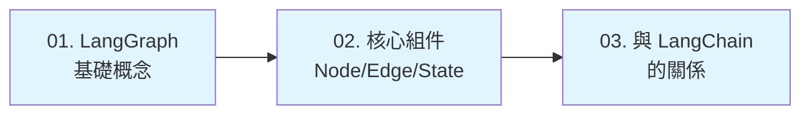
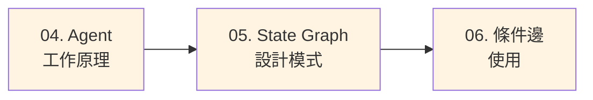
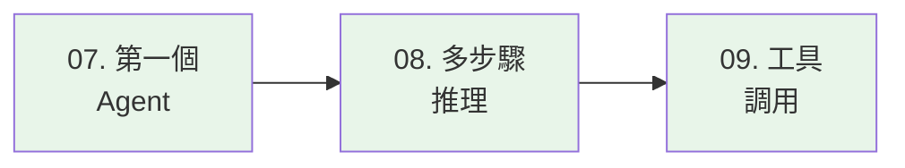
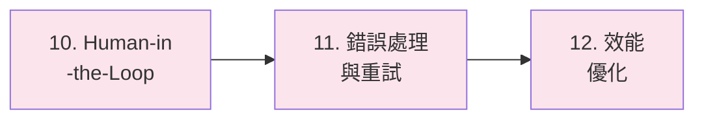
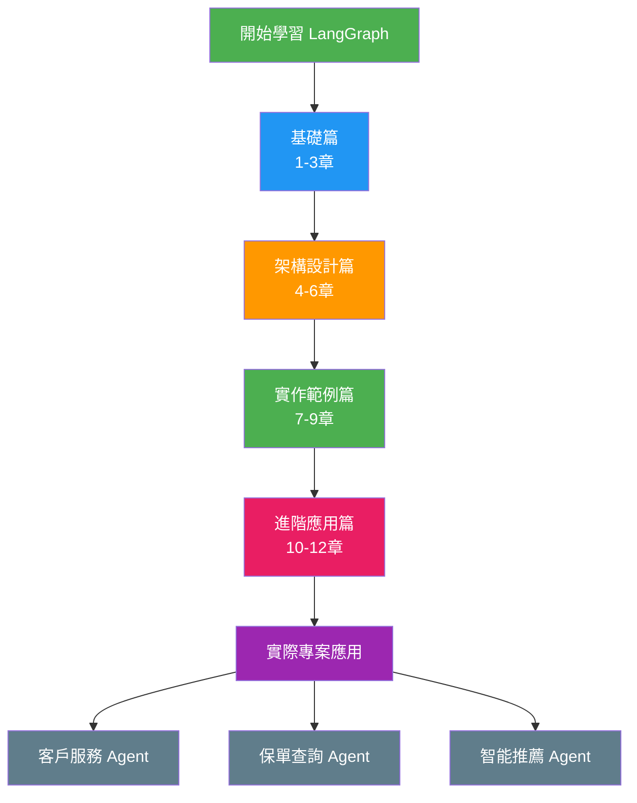

# LangGraph Agent 學習路徑

## 課程簡介

歡迎來到 LangGraph Agent 技術文件!本課程將帶您深入了解如何使用 LangGraph 建立智能 AI Agent,從基礎概念到進階應用,循序漸進地掌握 Agent 開發技術。

LangGraph 是 LangChain 生態系統中用於建立有狀態、多步驟推理 Agent 的強大框架。透過圖形化的方式定義 Agent 的工作流程,讓複雜的 AI 應用開發變得更加直觀和可維護。

!!! info "適合對象"
    - 熟悉 Python 基礎語法
    - 了解 LangChain 基本概念(建議但非必需)
    - 對 AI Agent 開發有興趣的開發者
    - 需要在專案中整合 AI 功能的工程師

## 學習目標

完成本課程後,您將能夠:

- ✅ 理解 LangGraph 的核心概念和架構
- ✅ 設計和實作複雜的 Agent 工作流程
- ✅ 整合各種工具和 API 到 Agent 中
- ✅ 處理錯誤和實作重試機制
- ✅ 優化 Agent 的效能和使用者體驗
- ✅ 應用於實際業務場景(如國泰人壽的客戶服務、保單查詢等)

## 課程架構

本課程共分為四大部分,總計 12 個章節:

### 📚 基礎篇 (第 1-3 章)

建立對 LangGraph 的基礎認知,了解核心概念和組件。



| 章節 | 主題 | 重點內容 |
|------|------|----------|
| 01 | LangGraph 基礎概念 | 什麼是 LangGraph、為何需要 LangGraph、核心特性 |
| 02 | 核心組件介紹 | Node、Edge、State 的定義與使用 |
| 03 | 與 LangChain 的關係 | 生態系統整合、何時使用 LangGraph vs LangChain |

### 🏗️ 架構設計篇 (第 4-6 章)

深入理解 Agent 的工作原理和設計模式。



| 章節 | 主題 | 重點內容 |
|------|------|----------|
| 04 | Agent 工作原理 | 執行流程、狀態管理、決策機制 |
| 05 | State Graph 設計模式 | 圖形結構設計、狀態轉換、最佳實踐 |
| 06 | 條件邊使用 | 動態路由、條件判斷、分支邏輯 |

### 💻 實作範例篇 (第 7-9 章)

透過實際程式碼範例,學習如何建立各種類型的 Agent。



| 章節 | 主題 | 重點內容 |
|------|------|----------|
| 07 | 建立第一個 Agent | Hello World Agent、基本流程、除錯技巧 |
| 08 | 多步驟推理 Agent | 複雜推理流程、中間狀態管理、結果整合 |
| 09 | 工具調用整合 | 外部 API 整合、自訂工具、錯誤處理 |

### 🚀 進階應用篇 (第 10-12 章)

掌握進階功能和最佳實踐,打造生產級 Agent 應用。



| 章節 | 主題 | 重點內容 |
|------|------|----------|
| 10 | Human-in-the-Loop | 人機協作模式、審核機制、互動設計 |
| 11 | 錯誤處理與重試 | 異常捕獲、自動重試、降級策略 |
| 12 | 效能優化 | 快取策略、並行處理、資源管理 |

## 完整學習地圖



## 建議學習方式

### 🎯 循序漸進

按照章節順序學習,每章都建立在前一章的基礎上:

1. **閱讀理論** - 理解概念和原理
2. **研究範例** - 分析程式碼實作
3. **動手實作** - 完成章節練習
4. **應用場景** - 思考如何應用在實際專案

### 📝 實作優先

每一章都包含完整的程式碼範例:

- 所有範例都可以直接執行
- 包含詳細的註解說明
- 提供實際應用場景
- 附帶練習題和解答思路

### 🤝 結合業務

以國泰人壽實際場景為例:

- **客戶服務** - 自動回答保單問題
- **理賠處理** - 輔助理賠流程判斷
- **產品推薦** - 根據客戶需求推薦產品
- **文件處理** - 自動分類和提取資訊

!!! example "實際應用範例預覽"
    在後續章節中,您將學習如何建立:

    ```python
    # 保單查詢 Agent 範例
    agent = PolicyQueryAgent(
        llm=ChatOpenAI(),
        tools=[policy_search, customer_info],
        memory=ConversationMemory()
    )

    result = agent.run("請幫我查詢張先生的壽險保單")
    ```

## 環境準備

### 安裝套件

```bash
# 建立虛擬環境
python -m venv venv
source venv/bin/activate  # Windows: venv\Scripts\activate

# 安裝必要套件
pip install langgraph langchain langchain-openai python-dotenv

# 安裝其他工具
pip install langchain-community langsmith
```

### 環境變數設定

建立 `.env` 檔案:

```bash
# OpenAI API Key
OPENAI_API_KEY=sk-your-api-key-here

# LangSmith (選用,用於除錯和追蹤)
LANGCHAIN_TRACING_V2=true
LANGCHAIN_API_KEY=ls-your-api-key-here
LANGCHAIN_PROJECT=langgraph-tutorial
```

### 驗證安裝

```python
# test_setup.py
from langchain_openai import ChatOpenAI
from langgraph.graph import StateGraph
from dotenv import load_dotenv

# 載入環境變數
load_dotenv()

# 測試 LLM 連線
llm = ChatOpenAI(model="gpt-4")
response = llm.invoke("Hello, LangGraph!")
print(f"✅ LLM 測試成功: {response.content}")

# 測試 LangGraph
workflow = StateGraph(dict)
print("✅ LangGraph 導入成功")

print("\n🎉 環境設定完成,可以開始學習!")
```

## 學習資源

### 官方文件

- [LangGraph 官方文件](https://python.langchain.com/docs/langgraph)
- [LangChain 官方文件](https://python.langchain.com/)
- [LangSmith 平台](https://smith.langchain.com/)

### 程式碼範例

- 本課程所有範例程式碼都可在實際環境中執行
- 每章節末尾都有完整的程式碼和練習題
- 包含國泰人壽實際業務場景的應用範例

### 社群支援

- LangChain Discord 社群
- GitHub Issues 和 Discussions
- Stack Overflow #langgraph 標籤

## 課程特色

### 🎓 教學品質

- **系統化教學** - 從基礎到進階,循序漸進
- **實戰導向** - 所有範例都來自實際應用場景
- **中文講解** - 繁體中文詳細說明,易於理解

### 💡 實用性

- **完整程式碼** - 每個範例都可直接執行
- **業務場景** - 結合國泰人壽實際需求
- **最佳實踐** - 包含生產環境的注意事項

### 🔧 可維護性

- **清晰架構** - 模組化設計,易於擴展
- **錯誤處理** - 完整的異常處理機制
- **測試友善** - 提供測試範例和技巧

## 版本資訊

本教學基於以下版本開發:

```python
langgraph==0.2.0
langchain==0.3.0
langchain-openai==0.2.0
python>=3.10
```

!!! warning "版本注意事項"
    LangGraph 持續快速發展中,API 可能會有變動。建議使用指定版本以確保範例正常運作。

## 開始學習

準備好了嗎?讓我們從第一章開始,探索 LangGraph 的世界!

<div style="text-align: center; margin: 2em 0;">
    <a href="basics/01-langgraph-intro/" style="
        display: inline-block;
        padding: 12px 24px;
        background-color: #2196F3;
        color: white;
        text-decoration: none;
        border-radius: 4px;
        font-weight: bold;
        box-shadow: 0 2px 4px rgba(0,0,0,0.2);
    ">
        開始學習 →
    </a>
</div>

## 學習追蹤

建議您建立一個學習筆記,記錄:

- [ ] 每章節的重點概念
- [ ] 實作過程中遇到的問題和解決方式
- [ ] 可以應用在專案中的想法
- [ ] 自己的程式碼範例和改進

## 常見問題

### Q1: 需要先學 LangChain 嗎?

**A:** 建議但非必需。本課程會在第 3 章詳細說明 LangGraph 與 LangChain 的關係。如果您完全沒接觸過 LangChain,建議先了解基本概念(LLM、Prompt、Chain)。

### Q2: 完成課程需要多少時間?

**A:** 如果每天投入 2-3 小時,預計 2-3 週可以完成所有章節。建議不要急於求成,每章都要動手實作。

### Q3: 可以跳章學習嗎?

**A:** 不建議。每章都建立在前面的基礎上,跳章可能會造成理解困難。

### Q4: 範例程式碼可以用在生產環境嗎?

**A:** 範例主要用於教學目的,實際用於生產環境前需要:
- 完善的錯誤處理
- 安全性檢查
- 效能優化
- 完整的測試

## 回饋與建議

如果您在學習過程中有任何問題或建議,歡迎:

- 在課程群組中提問
- 向課程負責人反映
- 提供改進建議

祝您學習愉快! 🚀
