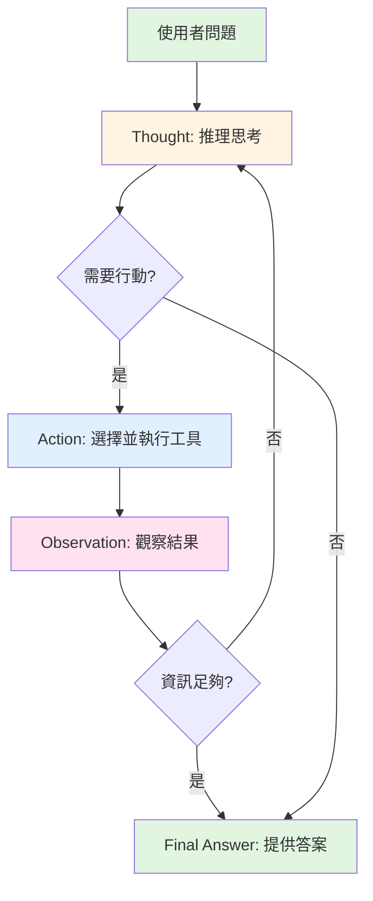

# 01. ReAct 模式介紹

## 什麼是 ReAct?

**ReAct** 是 **Re**asoning and **Act**ing 的縮寫,是一種革命性的 AI Agent 設計模式,由 Yao et al. 在 2022 年提出。它的核心理念是:

> **讓 AI 像人類一樣,在思考 (Reasoning) 和行動 (Acting) 之間不斷循環,透過觀察行動結果來持續優化推理過程。**

### ReAct 的核心理念

想像你正在解決一個複雜問題,例如規劃一趟旅行:

1. 🧠 **思考**: "我需要先查詢目的地的天氣"
2. 🎯 **行動**: 使用天氣查詢工具
3. 👁️ **觀察**: "未來三天都是晴天"
4. 🧠 **思考**: "天氣不錯,那我再查詢飯店價格"
5. 🎯 **行動**: 使用飯店價格查詢工具
6. 👁️ **觀察**: "五星級飯店一晚 5000 元"
7. 🧠 **思考**: "預算內可接受,確認訂房"

這就是 ReAct 的核心:不斷在**思考**、**行動**、**觀察**之間循環,直到問題解決。

---

## ReAct 的誕生背景

在 ReAct 出現之前,AI Agent 面臨兩大困境:

### ❌ 困境 1: 純推理模型的限制

傳統的 Chain-of-Thought (CoT) 模型只會推理,無法執行實際操作:

```
使用者: 台北今天的天氣如何?

AI (純推理):
思考: 我需要知道台北今天的天氣...
思考: 台北是台灣的首都,通常氣候溫暖...
思考: 今天是夏天,可能會很熱...
回答: 根據推理,台北今天應該是炎熱的天氣

❌ 問題: 純靠推理,無法取得即時準確的天氣資訊
```

### ❌ 困境 2: 純行動模型的限制

只會使用工具的模型缺乏推理能力,可能盲目執行:

```
使用者: 台北今天的天氣如何?

AI (純行動):
行動: 呼叫 weather_api("台北")
行動: 呼叫 traffic_api("台北")  ❌ 不需要
行動: 呼叫 stock_api("台北")   ❌ 不需要

❌ 問題: 沒有思考就行動,浪費資源且可能得到無關結果
```

### ✅ ReAct 的解決方案

ReAct 結合了兩者的優勢:

```
使用者: 台北今天的天氣如何?

AI (ReAct):
Thought: 我需要查詢台北的即時天氣資訊
Action: weather_api
Action Input: {"location": "台北", "date": "today"}
Observation: 晴天,溫度 28°C,濕度 65%

Thought: 我已經取得準確的天氣資訊,可以回答了
Final Answer: 台北今天是晴天,溫度 28°C,濕度 65%,天氣不錯!

✅ 完美結合推理與行動!
```

---

## ReAct 的工作原理

ReAct 的核心是三個組件的循環互動:

### 1️⃣ Reasoning (推理)

在每一步行動前,AI 會先**思考**:
- 當前的目標是什麼?
- 我已經知道哪些資訊?
- 下一步應該做什麼?
- 應該使用哪個工具?

### 2️⃣ Acting (行動)

根據推理結果,AI 選擇並**執行**具體操作:
- 選擇合適的工具
- 提供正確的輸入參數
- 實際呼叫工具

### 3️⃣ Observation (觀察)

AI **觀察**行動的結果:
- 工具執行成功了嗎?
- 得到了什麼資訊?
- 是否需要進一步行動?

---

## ReAct 循環流程



### 執行步驟詳解

1. **開始**: 使用者提出問題
2. **Thought**: AI 分析問題,規劃策略
3. **判斷**: 是否需要使用工具?
   - 如果**是** → 進入 Action
   - 如果**否** → 直接回答
4. **Action**: 執行工具取得資訊
5. **Observation**: 觀察工具執行結果
6. **判斷**: 資訊是否足夠回答問題?
   - 如果**否** → 回到 Thought,繼續思考
   - 如果**是** → 提供最終答案
7. **結束**: 問題解決

---

## 實際執行範例

讓我們看一個完整的 ReAct 執行過程:

### 問題

> "台北今天的天氣如何?適合戶外活動嗎?"

### 完整執行過程

```
=== Round 1 ===

Thought: 我需要先查詢台北今天的天氣資訊,
        包括溫度、降雨機率和空氣品質。

Action: weather_search
Action Input: {"location": "台北", "date": "today"}

Observation: {
  "temperature": 28,
  "weather": "晴天",
  "rainfall_probability": 10,
  "humidity": 65,
  "wind_speed": 12
}

---

=== Round 2 ===

Thought: 我已經取得天氣資訊,但要判斷是否適合戶外活動,
        還需要確認空氣品質指標 (AQI)。

Action: air_quality_search
Action Input: {"location": "台北"}

Observation: {
  "aqi": 45,
  "level": "良好",
  "pm2.5": 18
}

---

=== Round 3 ===

Thought: 現在我有完整的資訊了:
        - 天氣: 晴天,28°C
        - 降雨機率: 10% (很低)
        - 空氣品質: 良好 (AQI 45)
        我可以提供完整的建議了。

Final Answer: 台北今天天氣非常適合戶外活動!
☀️ 天氣: 晴天,溫度舒適 (28°C)
💧 降雨機率: 僅 10%,幾乎不會下雨
🌬️ 空氣品質: 良好 (AQI 45)

建議您可以安心進行戶外活動,記得做好防曬措施!
```

### 執行分析

在這個範例中,ReAct 進行了 **3 輪循環**:

| 輪次 | Thought | Action | Observation | 下一步 |
|------|---------|--------|-------------|--------|
| 1 | 需要天氣資訊 | 查詢天氣 API | 取得溫度、降雨等資訊 | 繼續 |
| 2 | 需要空氣品質資訊 | 查詢空氣品質 API | 取得 AQI 資訊 | 繼續 |
| 3 | 資訊完整,可回答 | - | - | 結束 |

---

## 為什麼需要 ReAct?

### 傳統方法的問題

#### 問題 1: 純推理無法取得即時資訊

```python
# 純 CoT (Chain of Thought)
prompt = "台北今天的股票市場表現如何?"

# AI 只能推理,無法查詢即時資料
# 結果: 給出過時或猜測的資訊 ❌
```

#### 問題 2: 純行動缺乏規劃

```python
# 純 Tool Calling
tools = [weather_api, stock_api, news_api, traffic_api]

# AI 可能盲目呼叫所有工具
# 結果: 浪費資源,得到無關資訊 ❌
```

### ReAct 的優勢

```python
# ReAct 模式
# ✅ 先思考需要什麼資訊
# ✅ 只呼叫必要的工具
# ✅ 根據結果動態調整
# ✅ 提供準確且即時的答案
```

---

## ReAct 的六大優勢

### 1. 🎯 可解釋性 (Interpretability)

每一步的思考過程都是透明的,你可以清楚看到 AI 為什麼做出某個決策。

```
Thought: 我發現使用者詢問的是"今天"的天氣,
        所以我需要呼叫即時天氣 API,而不是歷史天氣資料。
```

### 2. 🔄 動態調整能力

AI 可以根據觀察結果調整策略,不會固守原計劃。

```
Observation: API 回傳錯誤 "城市名稱無效"
Thought: 看來我需要先搜尋正確的城市代碼
Action: city_search
```

### 3. 🛠️ 工具靈活運用

可以整合任意數量和類型的工具,AI 會根據需求選擇。

```python
available_tools = [
    weather_api,
    stock_api,
    database_query,
    calculator,
    web_search,
    # ... 可以無限擴展
]
```

### 4. 🐛 錯誤自我修正

遇到錯誤時,AI 可以思考並嘗試其他方法。

```
Action: outdated_api
Observation: Error: API 已停用
Thought: 這個 API 失效了,我應該使用新的 API
Action: new_api
```

### 5. 📊 多步驟推理

可以處理需要多個步驟才能解決的複雜問題。

```
步驟 1: 查詢天氣
步驟 2: 查詢交通
步驟 3: 查詢餐廳
步驟 4: 整合資訊提供建議
```

### 6. 🎓 持續學習

通過觀察行動結果,AI 在每一步都在"學習"和改進。

---

## ReAct 的限制

雖然 ReAct 很強大,但也有一些限制需要注意:

### 1. 💰 成本較高

每次 Thought 都需要呼叫 LLM,多輪循環會增加成本。

```
單次問答:
- 傳統方法: 1 次 LLM 呼叫
- ReAct: 3-5 次 LLM 呼叫 (視問題複雜度)

成本增加: 3-5 倍 💸
```

**解決方案**:
- 使用較便宜的模型 (如 GPT-3.5 而非 GPT-4)
- 設定最大迭代次數限制
- 對簡單問題使用直接回答,不啟用 ReAct

### 2. 🔁 可能的無限循環

如果沒有適當的終止條件,Agent 可能陷入無限循環。

```
Thought: 我需要更多資訊
Action: search
Observation: 找到一些資訊
Thought: 資訊還不夠,需要更多
Action: search
... (無限循環) ❌
```

**解決方案**:
- 設定 `max_iterations` 參數
- 在 Prompt 中強調何時應該停止
- 設計更好的終止判斷邏輯

### 3. 🪙 Token 消耗大

每一輪都需要傳遞完整的對話歷史,Token 消耗快速增長。

```
Round 1: 1000 tokens
Round 2: 1500 tokens (包含 Round 1 的歷史)
Round 3: 2200 tokens (包含 Round 1-2 的歷史)

總計: 4700 tokens (遠超單次對話)
```

**解決方案**:
- 使用對話摘要 (Summarization)
- 只保留關鍵的歷史資訊
- 定期清理不必要的歷史

### 4. ⏱️ 速度較慢

多輪推理需要時間,不適合即時性要求極高的場景。

```
傳統方法: ~2 秒
ReAct (3 輪): ~6 秒
ReAct (5 輪): ~10 秒
```

**解決方案**:
- 使用更快的模型
- 並行執行部分工具呼叫
- 使用串流回應 (Streaming) 改善使用者體驗

---

## ReAct vs 其他模式

### 對比表

| 特性 | ReAct | Chain-of-Thought | Tool Calling | Function Calling |
|------|-------|------------------|--------------|------------------|
| 推理能力 | ✅ 強 | ✅ 強 | ❌ 弱 | ❌ 弱 |
| 工具使用 | ✅ 是 | ❌ 否 | ✅ 是 | ✅ 是 |
| 動態調整 | ✅ 是 | ❌ 否 | ⚠️ 有限 | ⚠️ 有限 |
| 可解釋性 | ✅ 高 | ✅ 高 | ⚠️ 中 | ⚠️ 中 |
| 成本 | ⚠️ 高 | ⚠️ 中 | ✅ 低 | ✅ 低 |
| 速度 | ⚠️ 慢 | ✅ 快 | ✅ 快 | ✅ 快 |

### 使用場景建議

- **簡單問答**: 使用 Function Calling 即可
- **需要推理但不需工具**: 使用 Chain-of-Thought
- **複雜多步驟任務**: 使用 ReAct ✅
- **需要動態決策**: 使用 ReAct ✅

---

## 重點整理

### 核心概念

1. **ReAct = Reasoning + Acting**
   - 思考與行動的循環
   - 觀察結果持續優化

2. **三大組件**
   - Thought: 推理思考
   - Action: 執行工具
   - Observation: 觀察結果

3. **執行流程**
   - 循環執行直到問題解決
   - 每一步都是透明可追蹤的

### 適用場景

✅ **推薦使用**:
- 多步驟推理任務
- 需要工具調用
- 需要動態決策
- 需要可解釋性

❌ **不推薦**:
- 簡單問答
- 即時性要求極高
- 成本敏感的應用

### 關鍵優勢

- 可解釋性強
- 動態調整能力
- 工具靈活運用
- 錯誤自我修正

### 主要限制

- 成本較高 (多次 LLM 呼叫)
- 可能無限循環 (需設定終止條件)
- Token 消耗大 (歷史累積)
- 速度較慢 (多輪推理)

---

## 下一步

現在你已經了解 ReAct 的核心概念,接下來讓我們深入探討 ReAct 的三大核心組件:

👉 [02. ReAct 核心組件](02-react-components.md)

在下一篇中,你將學到:
- Thought、Action、Observation 的詳細解析
- 三者如何互動
- 設計最佳實踐
- 完整的多步驟範例

---

> **💡 小提示**: 理解 ReAct 的關鍵在於體會「思考」和「行動」的循環。試著在日常工作中觀察自己是如何解決問題的,你會發現人類也是這樣運作的!
