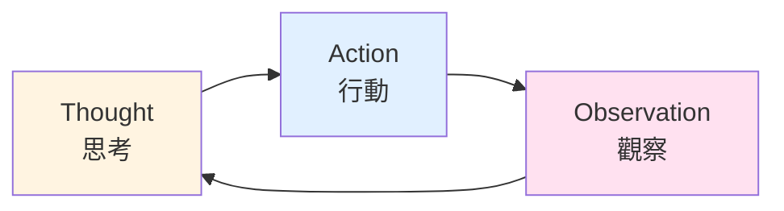
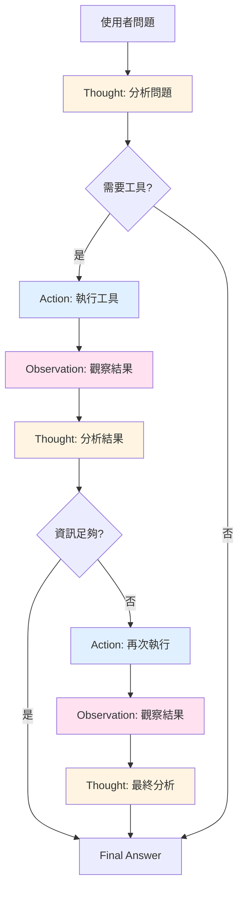
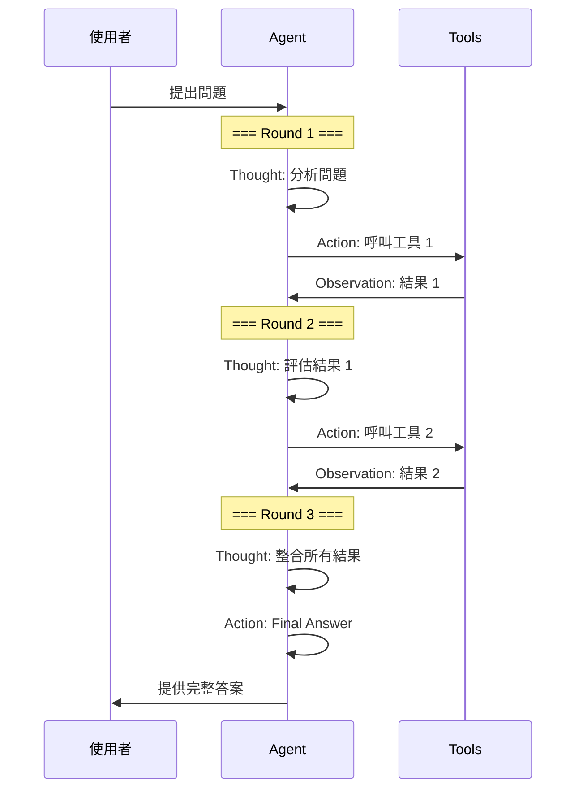

# 02. ReAct 核心組件

## 組件概覽

ReAct 模式由三大核心組件構成,它們協同運作,形成強大的推理-行動循環:



### 三大組件簡介

| 組件 | 英文名稱 | 功能 | 輸出格式 |
|------|----------|------|----------|
| 🧠 **Thought** | Reasoning | 分析問題、規劃策略 | 思考過程的文字描述 |
| 🎯 **Action** | Acting | 選擇並執行工具 | 工具名稱 + 參數 |
| 👁️ **Observation** | Observing | 接收並理解結果 | 工具執行結果 |

### 組件間的關係



---

## Thought (思考) 組件

### 定義與功能

**Thought** 是 Agent 的「大腦」,負責:
- 分析當前情況
- 規劃下一步策略
- 選擇合適的工具
- 評估行動結果

### 思考的四個層次

#### 1️⃣ 問題分析

理解使用者的真正需求。

```
使用者: 台北今天適合騎車嗎?

Thought (問題分析):
使用者詢問的不只是天氣,而是「適合騎車」的綜合條件。
我需要考慮:
- 天氣狀況 (晴雨、溫度)
- 空氣品質
- 風速
```

#### 2️⃣ 策略規劃

決定解決問題的步驟。

```
Thought (策略規劃):
要回答這個問題,我需要:
1. 先查詢天氣資訊
2. 再查詢空氣品質
3. 整合資訊後給出建議
```

#### 3️⃣ 工具選擇

從可用工具中選擇最合適的。

```
可用工具:
- weather_api: 查詢天氣
- air_quality_api: 查詢空氣品質
- traffic_api: 查詢交通狀況
- stock_api: 查詢股票

Thought (工具選擇):
根據需求,我應該使用:
1. weather_api (取得天氣)
2. air_quality_api (取得空氣品質)
不需要 traffic_api 和 stock_api
```

#### 4️⃣ 結果評估

判斷取得的資訊是否足夠。

```
Observation: 晴天,28°C,AQI 良好

Thought (結果評估):
我已經取得:
✅ 天氣: 晴天
✅ 溫度: 28°C (舒適)
✅ 空氣品質: 良好
資訊完整,可以提供建議了。
```

### Thought 的最佳實踐

#### ✅ 好的 Thought

```
Thought: 使用者詢問台北的天氣,我需要呼叫 weather_api
        取得即時資訊。我將使用 "台北" 作為地點參數,
        "today" 作為日期參數。
```

**特點**:
- 明確說明要做什麼
- 解釋為什麼這樣做
- 具體說明參數選擇

#### ❌ 不好的 Thought

```
Thought: 查天氣
```

**問題**:
- 太簡短,缺乏推理過程
- 沒有說明為什麼選擇這個工具
- 沒有規劃後續步驟

### 常見 Thought 模式範例

#### 模式 1: 初步分析

```
Thought: 使用者想知道 X,為了回答這個問題,
        我需要先取得 Y 資訊,然後分析 Z。
```

#### 模式 2: 工具選擇

```
Thought: 我有以下可用工具 [A, B, C],
        根據當前需求,工具 B 最適合,
        因為它可以直接提供所需的資訊。
```

#### 模式 3: 結果整合

```
Thought: 我已經取得了 [資訊 1, 資訊 2, 資訊 3],
        現在我可以整合這些資訊來回答使用者的問題。
```

#### 模式 4: 錯誤處理

```
Thought: 上一次的行動失敗了,錯誤訊息是 "XXX"。
        我應該嘗試使用另一個方法 YYY。
```

---

## Action (行動) 組件

### 定義與功能

**Action** 是 Agent 的「手」,負責:
- 執行具體操作
- 呼叫外部工具
- 傳遞正確參數
- 觸發實際功能

### Action 的類型

#### 類型 1: 工具呼叫

最常見的 Action 類型。

```
Action: weather_search
Action Input: {"location": "台北", "date": "2024-03-15"}
```

#### 類型 2: 資訊檢索

從資料庫或文件中查詢資訊。

```
Action: database_query
Action Input: {"table": "policies", "policy_id": "CL202401001"}
```

#### 類型 3: 計算執行

執行數學計算或程式邏輯。

```
Action: calculator
Action Input: {"expression": "(25000 * 12) * 0.05"}
```

#### 類型 4: 最終答案

當不需要工具時,直接提供答案。

```
Action: Final Answer
Action Input: "台北今天天氣晴朗,溫度舒適,非常適合騎車!"
```

### Action 的格式規範

#### 標準格式

```
Action: [工具名稱]
Action Input: [JSON 格式的參數]
```

#### 範例 1: 單一參數

```
Action: web_search
Action Input: {"query": "台北天氣"}
```

#### 範例 2: 多個參數

```
Action: send_email
Action Input: {
    "to": "user@example.com",
    "subject": "天氣通知",
    "body": "今天天氣晴朗"
}
```

#### 範例 3: 巢狀參數

```
Action: database_query
Action Input: {
    "operation": "select",
    "table": "users",
    "conditions": {
        "age": {"gt": 18},
        "city": "台北"
    }
}
```

### Action 的設計原則

#### 原則 1: 明確性

Action 應該明確指定要做什麼。

```
✅ 好的 Action:
Action: get_weather
Action Input: {"location": "台北", "date": "today"}

❌ 不好的 Action:
Action: search
Action Input: "天氣"
```

#### 原則 2: 完整性

提供所有必要的參數。

```
✅ 好的 Action:
Action: book_hotel
Action Input: {
    "city": "台北",
    "check_in": "2024-03-15",
    "check_out": "2024-03-16",
    "guests": 2
}

❌ 不好的 Action:
Action: book_hotel
Action Input: {"city": "台北"}  # 缺少必要參數
```

#### 原則 3: 正確性

參數格式必須符合工具要求。

```
✅ 好的 Action:
Action: calculator
Action Input: {"expression": "100 * 0.05"}

❌ 不好的 Action:
Action: calculator
Action Input: "100 * 0.05"  # 應該是 JSON 物件
```

---

## Observation (觀察) 組件

### 定義與功能

**Observation** 是 Agent 的「眼睛」,負責:
- 接收工具執行結果
- 理解返回的資訊
- 識別錯誤訊息
- 更新狀態資訊

### Observation 的內容類型

#### 類型 1: 成功結果

工具成功執行並返回資料。

```
Action: weather_search
Action Input: {"location": "台北"}

Observation: {
    "temperature": 28,
    "weather": "晴天",
    "humidity": 65,
    "wind_speed": 12
}
```

#### 類型 2: 錯誤訊息

工具執行失敗的錯誤資訊。

```
Action: database_query
Action Input: {"table": "invalid_table"}

Observation: Error: Table 'invalid_table' does not exist
```

#### 類型 3: 部分成功

部分資訊可用,部分失敗。

```
Action: get_stock_prices
Action Input: {"symbols": ["AAPL", "INVALID", "GOOGL"]}

Observation: {
    "AAPL": 150.25,
    "INVALID": "Symbol not found",
    "GOOGL": 2800.50
}
```

#### 類型 4: 狀態更新

系統狀態的變化。

```
Action: update_database
Action Input: {"record_id": 123, "status": "completed"}

Observation: Record updated successfully. Affected rows: 1
```

### Observation 的處理方式

#### 方式 1: 資訊擷取

從結果中擷取關鍵資訊。

```
Observation: {
    "temperature": 28,
    "weather": "晴天",
    "humidity": 65,
    "rainfall_probability": 10,
    "wind_speed": 12,
    "uv_index": 7
}

Thought: 從結果中我得知:
- 溫度 28°C (舒適)
- 天氣晴朗
- 降雨機率僅 10%
適合戶外活動!
```

#### 方式 2: 錯誤分析

分析錯誤原因並規劃應對。

```
Observation: Error: Invalid API key

Thought: API 金鑰無效,可能是:
1. 金鑰過期
2. 金鑰輸入錯誤
我應該通知使用者檢查 API 設定。
```

#### 方式 3: 結果驗證

檢查結果是否符合預期。

```
Observation: {"count": 0, "results": []}

Thought: 查詢結果為空,這可能表示:
1. 資料庫中沒有符合條件的記錄
2. 查詢條件太嚴格
我應該放寬條件重新查詢。
```

### Observation 的最佳實踐

#### ✅ 結構化 Observation

```
Observation: {
    "status": "success",
    "data": {
        "temperature": 28,
        "weather": "晴天"
    },
    "metadata": {
        "timestamp": "2024-03-15T10:00:00",
        "source": "weather_api_v2"
    }
}
```

**優點**:
- 清晰的結構
- 易於解析
- 包含元資訊

#### ❌ 非結構化 Observation

```
Observation: 天氣晴朗,大約 28 度左右,還不錯
```

**問題**:
- 難以程式化處理
- 缺乏精確資訊
- 無法驗證

---

## 三者的互動流程

### 詳細的互動序列圖



### 執行時序說明

#### 階段 1: 初始化

```
時間點 0: 使用者提出問題
         ↓
時間點 1: Agent 接收問題,進入 Round 1
```

#### 階段 2: Round 1 - 首次推理

```
時間點 2: Thought 1 - 分析問題
         "我需要先查詢 X 資訊"
         ↓
時間點 3: Action 1 - 執行工具
         呼叫 tool_X
         ↓
時間點 4: Observation 1 - 接收結果
         取得 result_X
```

#### 階段 3: Round 2 - 深入推理

```
時間點 5: Thought 2 - 評估結果
         "我還需要 Y 資訊來完整回答"
         ↓
時間點 6: Action 2 - 再次執行
         呼叫 tool_Y
         ↓
時間點 7: Observation 2 - 接收結果
         取得 result_Y
```

#### 階段 4: Round 3 - 最終整合

```
時間點 8: Thought 3 - 整合所有結果
         "我現在有完整資訊了"
         ↓
時間點 9: Action 3 - 提供答案
         Final Answer
         ↓
時間點 10: 使用者收到答案
```

---

## 完整範例:多步驟問題

### 問題

> "比較台北和高雄今天的天氣,推薦哪個城市適合戶外活動?"

### 完整執行過程

```
===============================
=== Round 1: 查詢台北天氣 ===
===============================

Thought:
使用者想比較台北和高雄的天氣,我需要分別查詢兩個城市的天氣資訊。
首先查詢台北的天氣。

Action: weather_search
Action Input: {
    "location": "台北",
    "date": "today"
}

Observation: {
    "location": "台北",
    "temperature": 28,
    "weather": "晴天",
    "rainfall_probability": 10,
    "humidity": 65,
    "wind_speed": 12,
    "uv_index": 7
}

===============================
=== Round 2: 查詢高雄天氣 ===
===============================

Thought:
我已經取得台北的天氣資訊(晴天,28°C),現在需要查詢高雄的天氣進行比較。

Action: weather_search
Action Input: {
    "location": "高雄",
    "date": "today"
}

Observation: {
    "location": "高雄",
    "temperature": 32,
    "weather": "多雲",
    "rainfall_probability": 30,
    "humidity": 75,
    "wind_speed": 8,
    "uv_index": 8
}

===============================
=== Round 3: 查詢空氣品質 ===
===============================

Thought:
我已經取得兩個城市的天氣資訊:
- 台北: 晴天,28°C,降雨機率 10%
- 高雄: 多雲,32°C,降雨機率 30%

為了更完整的建議,我還需要查詢兩個城市的空氣品質。

Action: air_quality_search
Action Input: {
    "locations": ["台北", "高雄"]
}

Observation: {
    "台北": {
        "aqi": 45,
        "level": "良好",
        "pm2.5": 18
    },
    "高雄": {
        "aqi": 68,
        "level": "普通",
        "pm2.5": 35
    }
}

====================================
=== Round 4: 整合資訊並提供建議 ===
====================================

Thought:
我現在有完整的比較資訊了:

台北:
- 天氣: 晴天
- 溫度: 28°C (舒適)
- 降雨機率: 10% (低)
- 空氣品質: AQI 45 (良好)
- 優勢: 天氣更好,空氣品質佳,溫度舒適

高雄:
- 天氣: 多雲
- 溫度: 32°C (較熱)
- 降雨機率: 30% (較高)
- 空氣品質: AQI 68 (普通)
- 劣勢: 較熱,可能下雨,空氣品質一般

綜合評估,台北更適合戶外活動。

Action: Final Answer

Final Answer:
📊 台北 vs 高雄天氣比較:

🏙️ 台北 (推薦 ⭐⭐⭐⭐⭐)
  ☀️ 天氣: 晴天
  🌡️ 溫度: 28°C (舒適宜人)
  💧 降雨機率: 10% (幾乎不會下雨)
  🌬️ 空氣品質: 良好 (AQI 45)

🏙️ 高雄 (⭐⭐⭐)
  ☁️ 天氣: 多雲
  🌡️ 溫度: 32°C (較炎熱)
  💧 降雨機率: 30% (有下雨可能)
  🌬️ 空氣品質: 普通 (AQI 68)

🎯 建議: 台北更適合戶外活動!
原因:
1. 天氣晴朗,能見度好
2. 溫度更舒適 (28°C vs 32°C)
3. 降雨風險低 (10% vs 30%)
4. 空氣品質更好 (45 vs 68)

如果您在台北,現在是絕佳的戶外活動時機!
記得做好防曬措施(UV指數 7)。
```

### 執行分析表

| 輪次 | Thought 重點 | Action | Observation 重點 | 獲得資訊 |
|------|--------------|--------|------------------|----------|
| 1 | 需要台北天氣 | weather_search("台北") | 晴天,28°C,10%降雨 | 台北基本天氣 |
| 2 | 需要高雄天氣 | weather_search("高雄") | 多雲,32°C,30%降雨 | 高雄基本天氣 |
| 3 | 需要空氣品質 | air_quality_search | 台北 45, 高雄 68 | 空氣品質對比 |
| 4 | 資訊完整,可比較 | Final Answer | - | 提供建議 |

---

## 設計原則

### Thought 設計原則

#### 1. 清晰明確

```
✅ Thought: 我需要查詢台北的天氣,使用 weather_api 工具,
           參數設定為 location="台北", date="today"

❌ Thought: 查天氣
```

#### 2. 邏輯連貫

```
✅ Thought: 因為使用者詢問「今天」的天氣,所以我應該使用
           即時天氣 API 而非歷史天氣資料

❌ Thought: 用天氣 API
```

#### 3. 前瞻規劃

```
✅ Thought: 我將先查詢天氣,如果天氣良好,再查詢空氣品質,
           最後提供綜合建議

❌ Thought: 先查天氣再說
```

### Action 設計原則

#### 1. 具體可執行

```
✅ Action: weather_search
   Action Input: {"location": "台北", "date": "2024-03-15"}

❌ Action: 查詢
   Action Input: "台北天氣"
```

#### 2. 參數完整

```
✅ Action: send_email
   Action Input: {
       "to": "user@example.com",
       "subject": "通知",
       "body": "內容"
   }

❌ Action: send_email
   Action Input: {"to": "user@example.com"}  # 缺少 subject 和 body
```

#### 3. 格式正確

```
✅ Action Input: {"city": "台北", "count": 5}

❌ Action Input: city=台北, count=5  # 不是 JSON 格式
```

### Observation 設計原則

#### 1. 結構化輸出

```
✅ Observation: {
       "status": "success",
       "temperature": 28,
       "weather": "晴天"
   }

❌ Observation: 天氣還不錯,大概 28 度吧
```

#### 2. 包含錯誤資訊

```
✅ Observation: {
       "status": "error",
       "error_code": "INVALID_LOCATION",
       "message": "城市名稱無效"
   }

❌ Observation: 錯誤
```

#### 3. 提供元資訊

```
✅ Observation: {
       "data": {...},
       "metadata": {
           "timestamp": "2024-03-15T10:00:00",
           "source": "weather_api_v2",
           "cache_hit": false
       }
   }
```

---

## 常見錯誤模式

### 錯誤 1: 思考不充分就行動

```
❌ 錯誤範例:

使用者: 台北天氣如何?

Thought: 查天氣
Action: weather_search
Action Input: "台北"  # 參數格式錯誤

Observation: Error: Invalid input format
```

**問題**: 沒有仔細思考參數格式要求

**改進**:
```
✅ 正確範例:

Thought: 我需要查詢台北的天氣,weather_search 工具需要
        JSON 格式的參數,包含 location 和 date

Action: weather_search
Action Input: {"location": "台北", "date": "today"}

Observation: {"temperature": 28, "weather": "晴天"}
```

### 錯誤 2: 忽略 Observation 的資訊

```
❌ 錯誤範例:

Round 1:
Action: weather_search
Observation: Error: API rate limit exceeded

Round 2:
Thought: 繼續查詢
Action: weather_search  # 完全忽略錯誤
Observation: Error: API rate limit exceeded  # 重複錯誤
```

**問題**: 沒有根據 Observation 調整策略

**改進**:
```
✅ 正確範例:

Round 1:
Action: weather_search
Observation: Error: API rate limit exceeded

Round 2:
Thought: API 達到速率限制,我應該使用備用的天氣資料源
Action: backup_weather_search
Observation: {"temperature": 28, "weather": "晴天"}
```

### 錯誤 3: 重複無效的 Action

```
❌ 錯誤範例:

Round 1-5: (全部重複相同的失敗操作)
Action: invalid_tool
Observation: Error: Tool not found
```

**問題**: 沒有學習和調整

**改進**:
```
✅ 正確範例:

Round 1:
Action: invalid_tool
Observation: Error: Tool not found

Round 2:
Thought: 這個工具不存在,讓我檢查可用工具列表
Action: list_available_tools
Observation: ["weather_search", "calculator", "database_query"]

Round 3:
Thought: 我應該使用 weather_search
Action: weather_search
Observation: Success
```

### 錯誤 4: 缺乏終止邏輯

```
❌ 錯誤範例:

Round 1: 查詢天氣 → 成功
Round 2: 再查詢天氣 → 成功
Round 3: 又查詢天氣 → 成功
... (無限循環)
```

**問題**: 沒有判斷何時該停止

**改進**:
```
✅ 正確範例:

Round 1:
Thought: 查詢天氣
Action: weather_search
Observation: 成功取得資料

Round 2:
Thought: 我已經取得所需資訊,可以回答了
Action: Final Answer
Final Answer: 台北今天晴天,28°C
```

---

## 組件優化技巧

### 優化 Thought 品質

#### 技巧 1: 使用結構化思考框架

```
Thought Template:
1. 當前狀況: [已知資訊]
2. 目標: [要達成什麼]
3. 缺少資訊: [還需要什麼]
4. 下一步: [具體行動]
```

範例:
```
Thought:
1. 當前狀況: 使用者詢問台北天氣
2. 目標: 提供準確的天氣資訊
3. 缺少資訊: 即時溫度、天氣狀況
4. 下一步: 呼叫 weather_api 查詢
```

#### 技巧 2: 加入推理鏈

```
Thought: 因為 [原因A],所以 [結論B],
        因此我應該 [行動C]
```

範例:
```
Thought: 因為使用者特別提到「今天」,
        所以需要即時資料而非歷史資料,
        因此我應該使用 realtime_weather_api 而非 historical_weather_api
```

### 優化 Action 設計

#### 技巧 1: 參數驗證

在 Action 前驗證參數:

```
Thought: 在呼叫 API 前,我先確認參數:
        - location: "台北" ✓ (有效城市)
        - date: "today" ✓ (有效日期)
        - format: "json" ✓ (支援格式)
        參數都正確,可以執行

Action: weather_search
Action Input: {"location": "台北", "date": "today", "format": "json"}
```

#### 技巧 2: 錯誤預防

```
Thought: 我將使用 try-catch 模式,如果主要 API 失敗,
        會自動切換到備用 API

Action: weather_search_with_fallback
Action Input: {
    "primary": {"api": "main_weather", "location": "台北"},
    "fallback": {"api": "backup_weather", "location": "台北"}
}
```

### 優化 Observation 處理

#### 技巧 1: 結構化解析

```
Observation: {
    "status": "success",
    "data": {
        "temperature": 28,
        "weather": "晴天"
    }
}

Thought: 解析 Observation:
        - 狀態: success ✓
        - 溫度: 28°C
        - 天氣: 晴天
        資訊完整,符合預期
```

#### 技巧 2: 錯誤分類處理

```
Observation: {
    "status": "error",
    "error_type": "RATE_LIMIT",
    "retry_after": 60
}

Thought: 錯誤類型分析:
        - RATE_LIMIT: 需要等待
        - retry_after: 60 秒
        策略: 使用快取資料或備用 API
```

### 設置循環限制

#### 方法 1: 最大迭代次數

```python
max_iterations = 5  # 最多 5 輪

if current_iteration > max_iterations:
    return "達到最大迭代次數,終止執行"
```

#### 方法 2: 時間限制

```python
max_execution_time = 30  # 30 秒

if elapsed_time > max_execution_time:
    return "執行超時,終止執行"
```

#### 方法 3: 智能終止

```
Thought: 我已經嘗試了 3 次,都得到相同的錯誤,
        繼續嘗試可能無效,應該向使用者說明情況

Action: Final Answer
Final Answer: 很抱歉,目前無法取得天氣資訊,
             請稍後再試或聯繫技術支援
```

---

## 組件特性總結表

### Thought (思考)

| 特性 | 說明 | 範例 |
|------|------|------|
| **輸入** | 使用者問題 + 歷史 Observations | "台北天氣如何?" + 先前的結果 |
| **輸出** | 推理過程的文字描述 | "我需要查詢即時天氣資訊" |
| **目的** | 分析、規劃、決策 | 決定下一步要做什麼 |
| **評估標準** | 邏輯清晰、考慮周全 | 是否考慮了所有可能性 |

### Action (行動)

| 特性 | 說明 | 範例 |
|------|------|------|
| **輸入** | Thought 的決策 | "使用 weather_api" |
| **輸出** | 工具名稱 + JSON 參數 | `{"location": "台北"}` |
| **目的** | 執行具體操作 | 實際呼叫 API |
| **評估標準** | 參數正確、格式規範 | JSON 格式是否正確 |

### Observation (觀察)

| 特性 | 說明 | 範例 |
|------|------|------|
| **輸入** | Action 的執行結果 | API 回傳的資料 |
| **輸出** | 結構化的結果資料 | `{"temp": 28, "weather": "晴"}` |
| **目的** | 提供資訊給下一輪 Thought | 讓 AI 知道行動的結果 |
| **評估標準** | 資訊完整、格式清晰 | 是否包含所有必要資訊 |

---

## 重點整理

### 三大組件的本質

- **Thought**: Agent 的「大腦」,負責**思考**
- **Action**: Agent 的「手」,負責**執行**
- **Observation**: Agent 的「眼睛」,負責**觀察**

### 設計黃金法則

1. **Thought 要詳細**: 充分推理,說明理由
2. **Action 要精確**: 正確格式,完整參數
3. **Observation 要結構化**: 清晰資訊,易於解析

### 常見陷阱

- ❌ Thought 太簡短
- ❌ Action 參數錯誤
- ❌ 忽略 Observation
- ❌ 無限循環

### 優化方向

- ✅ 使用思考框架
- ✅ 參數驗證機制
- ✅ 錯誤分類處理
- ✅ 設定循環限制

---

## 下一步

現在你已經深入理解 ReAct 的三大核心組件,接下來我們將學習如何設計高品質的 ReAct Prompt:

👉 [03. Prompt Engineering](03-prompt-engineering.md)

在下一篇中,你將學到:
- ReAct Prompt 的結構設計
- 如何引導模型正確思考
- 常用的 Prompt 模板
- Prompt 優化技巧

---

> **💡 實踐建議**: 試著在紙上畫出一個問題的 Thought → Action → Observation 流程圖,這會幫助你更深入理解三者的互動關係!
