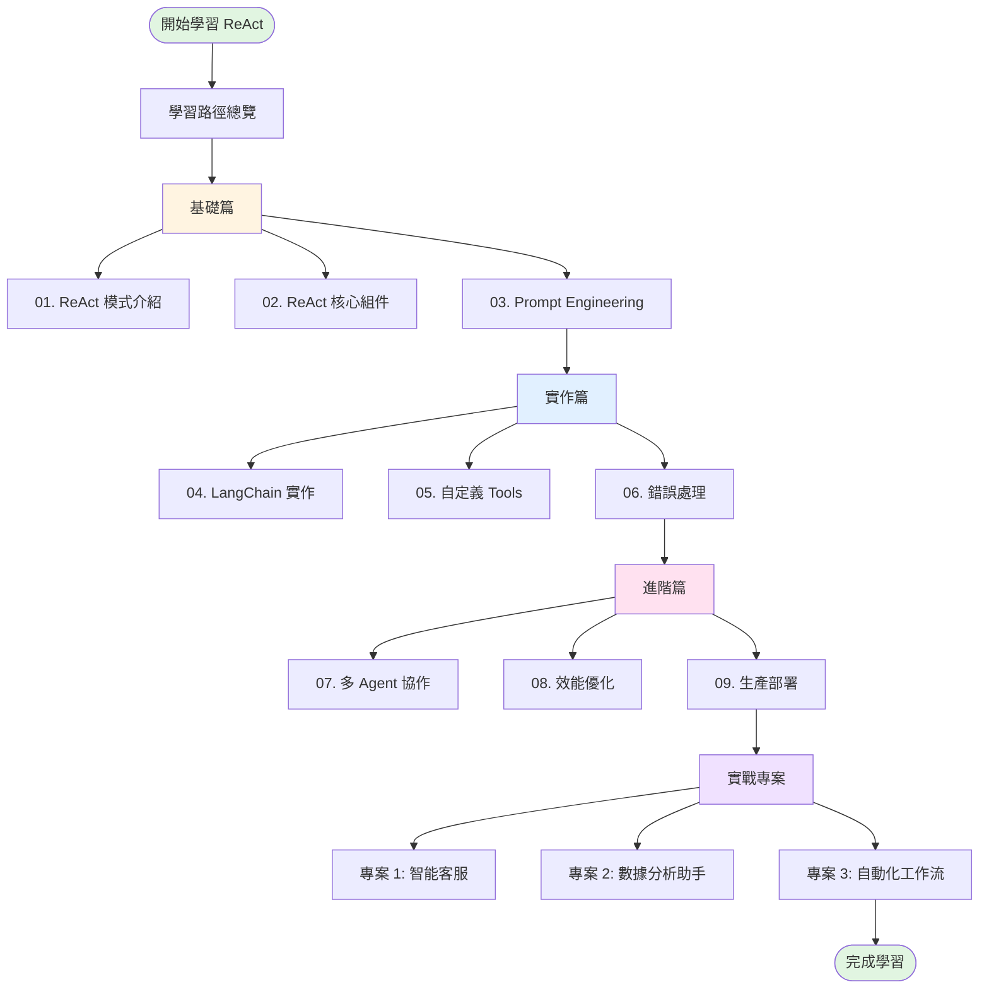

# ReAct 模式學習路徑

## 歡迎來到 ReAct 模式學習之旅

ReAct (Reasoning and Acting) 是一種革命性的 AI Agent 設計模式,它將**推理 (Reasoning)** 與**行動 (Acting)** 完美結合,讓 AI 能夠像人類一樣思考並解決複雜問題。

在傳統的 AI 系統中,模型要麼只會推理(純思考,無法行動),要麼只會行動(盲目執行,缺乏思考)。ReAct 打破了這個限制,通過**交替進行推理和行動**,使 AI Agent 能夠:

- 🧠 **主動思考**:在每一步之前先分析問題,規劃策略
- 🎯 **精準行動**:根據思考結果選擇最合適的工具執行
- 👁️ **持續觀察**:從行動結果中學習,調整下一步策略
- 🔄 **動態調整**:根據觀察結果不斷優化推理和行動

這種模式特別適合需要**多步驟推理**、**工具調用**和**動態決策**的複雜任務,是目前最先進的 AI Agent 實作方法之一。

---

## 📚 學習地圖

---

## 🎯 建議學習順序

### 🌱 初級階段 (預計 3-4 小時)

掌握 ReAct 的核心概念和基本原理。

**學習目標**:
- ✅ 理解 ReAct 是什麼,為什麼需要它
- ✅ 掌握 Thought、Action、Observation 三大組件
- ✅ 了解如何設計 ReAct Prompt
- ✅ 能夠閱讀和理解 ReAct 執行日誌

**學習內容**:
1. **ReAct 模式介紹** (01-react-intro.md)
   - ReAct 的定義與核心理念
   - 工作原理與執行流程
   - 優勢與限制分析
   - 實際執行範例

2. **ReAct 核心組件** (02-react-components.md)
   - Thought 組件深入解析
   - Action 組件設計規範
   - Observation 組件處理方式
   - 三者互動的完整流程

3. **Prompt Engineering** (03-prompt-engineering.md)
   - ReAct Prompt 結構設計
   - 如何引導模型思考
   - 常見 Prompt 模板
   - Prompt 優化技巧

**學習驗證**:
- [ ] 能夠解釋 ReAct 的執行循環
- [ ] 能夠識別 Thought、Action、Observation
- [ ] 能夠設計簡單的 ReAct Prompt

---

### 🚀 中級階段 (預計 5-6 小時)

學習如何在實際專案中實作 ReAct Agent。

**學習目標**:
- ✅ 使用 LangChain 框架建立 ReAct Agent
- ✅ 自定義工具並整合到 Agent
- ✅ 處理執行錯誤與異常情況
- ✅ 建立可用於生產的 Agent

**學習內容**:
4. **LangChain 實作** (04-langchain-implementation.md)
   - LangChain ReAct Agent 架構
   - create_react_agent 詳解
   - Agent Executor 配置
   - 實戰案例:客服助手

5. **自定義 Tools** (05-custom-tools.md)
   - Tool 的定義與設計原則
   - 使用 @tool 裝飾器
   - Tool 參數設計
   - Tool 錯誤處理

6. **錯誤處理與除錯** (06-error-handling.md)
   - 常見錯誤類型
   - 錯誤處理策略
   - 重試機制設計
   - 除錯技巧與工具

**學習驗證**:
- [ ] 能夠建立基本的 ReAct Agent
- [ ] 能夠自定義至少 3 個 Tools
- [ ] 能夠處理常見的執行錯誤

---

### 🎓 進階階段 (預計 6-8 小時)

探索 ReAct 的高級應用和最佳實踐。

**學習目標**:
- ✅ 設計多 Agent 協作系統
- ✅ 優化 Agent 效能與成本
- ✅ 部署 Agent 到生產環境
- ✅ 監控與維護 Agent 系統

**學習內容**:
7. **多 Agent 協作** (07-multi-agent.md)
   - 多 Agent 架構設計
   - Agent 間通訊機制
   - 任務分配與協調
   - 實戰案例:團隊協作系統

8. **效能優化** (08-performance-optimization.md)
   - Token 使用優化
   - 快取策略設計
   - 並行處理技巧
   - 成本控制方法

9. **生產部署** (09-production-deployment.md)
   - 部署架構設計
   - API 服務建立
   - 監控與日誌
   - 安全性考量

**學習驗證**:
- [ ] 能夠設計多 Agent 系統
- [ ] 能夠優化 Agent 效能
- [ ] 能夠部署 Agent 到生產環境

---

### 💼 實戰專案階段 (預計 10-15 小時)

通過完整專案整合所學知識。

**專案 1: 智能客服系統**
- 建立多輪對話客服 Agent
- 整合保單查詢、理賠查詢等工具
- 實作對話歷史管理
- 部署為 Web API 服務

**專案 2: 數據分析助手**
- 建立能夠分析資料的 Agent
- 整合 SQL 查詢、圖表生成工具
- 實作自然語言轉 SQL
- 生成分析報告

**專案 3: 自動化工作流 Agent**
- 建立任務自動化 Agent
- 整合郵件、檔案處理工具
- 實作多步驟工作流
- 異常處理與通知

---

## ⏱️ 預計學習時間

| 階段 | 內容 | 預計時間 | 累計時間 |
|------|------|---------|---------|
| 🌱 初級 | 基礎理論 (3 篇) | 3-4 小時 | 3-4 小時 |
| 🚀 中級 | 實作技術 (3 篇) | 5-6 小時 | 8-10 小時 |
| 🎓 進階 | 高級應用 (3 篇) | 6-8 小時 | 14-18 小時 |
| 💼 實戰 | 完整專案 (3 個) | 10-15 小時 | 24-33 小時 |
| **總計** | **完整學習** | **24-33 小時** | - |

> **💡 學習建議**: 建議每天學習 2-3 小時,持續 2-3 週完成整個課程。每學完一個階段後,實際動手練習至少 2-3 個小時。

---

## 📋 先修知識要求

### 必備知識 ✅

1. **Python 程式設計**
   - 基礎語法 (變數、函數、類別)
   - 裝飾器 (Decorators)
   - 型別提示 (Type Hints)
   - 異步程式設計 (Async/Await) - 基礎即可

2. **LLM 基礎概念**
   - 了解什麼是 Large Language Model
   - 知道 Prompt Engineering 基本原理
   - 熟悉 OpenAI API 使用 (或其他 LLM API)

3. **LangChain 框架** (推薦)
   - 了解 LangChain 基本架構
   - 熟悉 Chains 和 Agents 概念
   - 完成過 LangChain 基礎教學

### 建議先修課程 📚

如果你還不熟悉以上知識,建議先完成:

- **Python 基礎**: 任何 Python 入門課程
- **LangChain 基礎**: 本站的 [LangChain Tutorial](../langchain/notebooks/01-langchain-basics.ipynb)
- **LLM 概念**: OpenAI 官方文檔或相關入門文章

---

## 🎯 適用場景

ReAct 模式特別適合以下應用場景:

### ✅ 推薦使用 ReAct

1. **需要多步驟推理的任務**
   - 複雜問題分析
   - 數學計算與推導
   - 邏輯推理問題

2. **需要工具調用的任務**
   - 資料查詢 (資料庫、API)
   - 計算執行 (計算器、程式執行)
   - 資訊檢索 (搜尋引擎、文檔查詢)

3. **需要動態決策的任務**
   - 客服對話系統
   - 任務規劃與執行
   - 數據分析與報告生成

4. **需要可解釋性的任務**
   - 需要追蹤決策過程
   - 需要除錯和優化
   - 需要向使用者解釋執行邏輯

### ❌ 不推薦使用 ReAct

1. **簡單的問答任務**
   - 單一查詢即可回答
   - 不需要工具調用
   - 成本考量 (ReAct 較昂貴)

2. **即時性要求極高的任務**
   - 需要毫秒級回應
   - 延遲敏感的應用
   - (可考慮簡化版或快取策略)

3. **資源受限的環境**
   - Token 預算有限
   - API 呼叫次數受限
   - 成本敏感的應用

---

## 📖 學習資源

### 官方文檔

- [ReAct 原始論文](https://arxiv.org/abs/2210.03629) - Yao et al., 2022
- [LangChain ReAct Agent](https://python.langchain.com/docs/modules/agents/agent_types/react)
- [OpenAI Function Calling](https://platform.openai.com/docs/guides/function-calling)

### 推薦閱讀

- **基礎篇**: 先閱讀 LangChain 官方的 Agent 文檔
- **進階篇**: 閱讀 ReAct 論文了解理論基礎
- **實戰篇**: 參考 LangChain Cookbook 的範例

### 社群資源

- **GitHub**: 搜尋 "langchain react agent" 找實作範例
- **Discord**: 加入 LangChain 官方 Discord 社群
- **Stack Overflow**: 搜尋相關問題與解答

---

## 🚀 開始學習

準備好了嗎?讓我們從第一篇開始:

👉 [01. ReAct 模式介紹](01-react-intro.md)

在這篇文章中,你將學到:
- ReAct 的核心理念
- 完整的執行流程
- 實際的執行範例
- 為什麼 ReAct 如此強大

---

## 💬 學習建議

1. **循序漸進**: 按照建議順序學習,不要跳過基礎篇
2. **動手實作**: 每學完一篇文章,立即動手寫程式驗證
3. **記錄筆記**: 記錄遇到的問題和解決方法
4. **參與討論**: 在社群中分享學習心得,向他人請教
5. **完成專案**: 最後的實戰專案務必完成至少一個

> **記住**: ReAct 不只是一個技術,更是一種思考方式。理解其背後的推理邏輯,比單純記憶語法更重要!

---

**準備好開始這段精彩的學習之旅了嗎?** 🎉

讓我們一起探索 ReAct 模式的奧秘,建立真正智能的 AI Agent!
